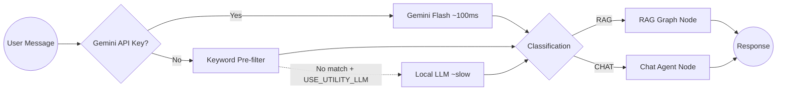
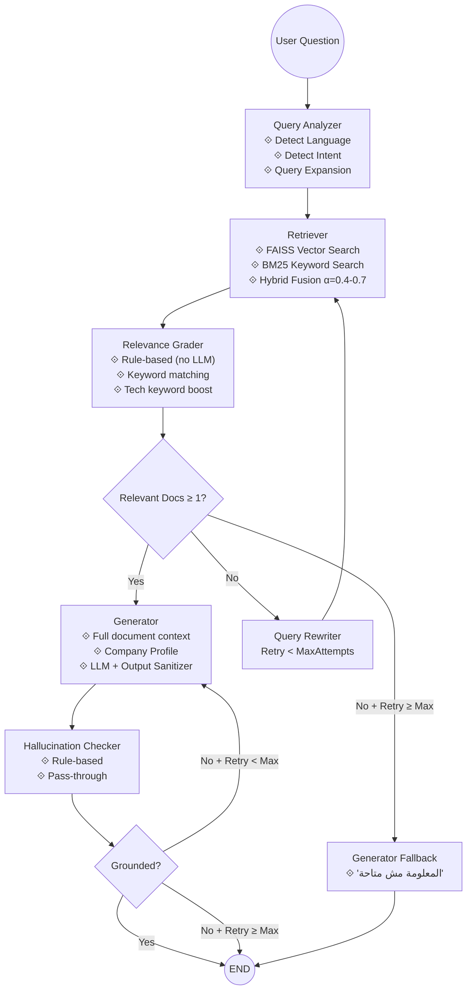
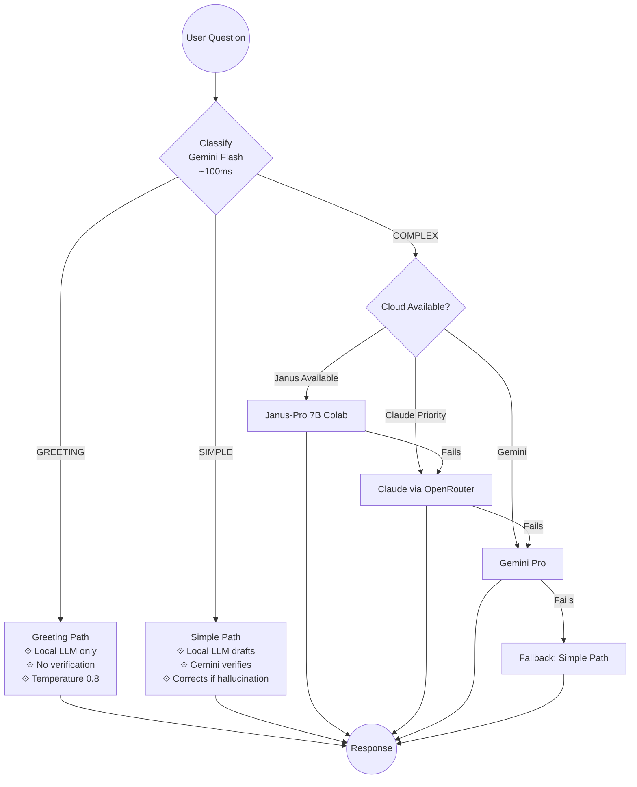
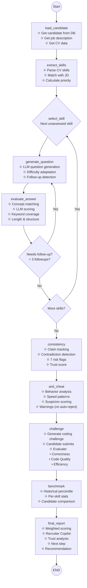
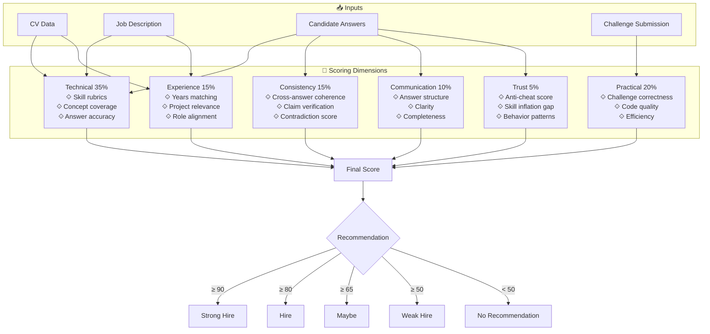
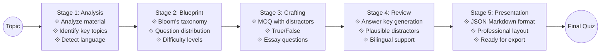
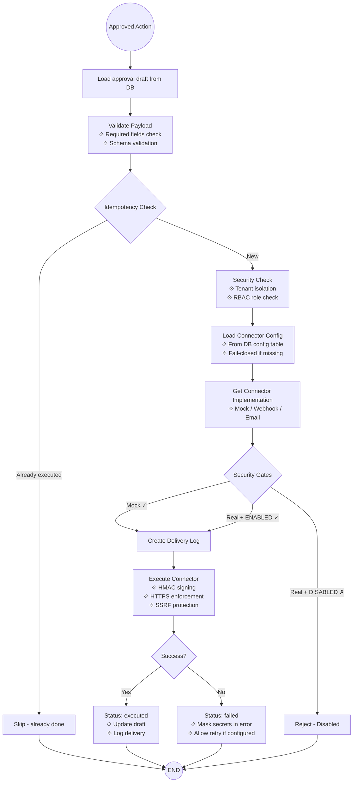
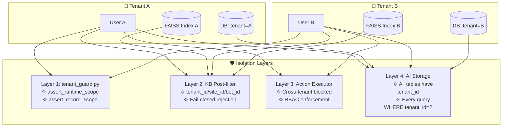
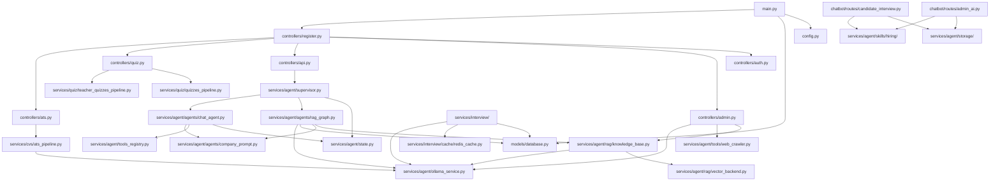

# 🏗️ MAESTA — الرسومات المعمارية

> استخدم أي عارض Mermaid (GitHub، VS Code مع إضافة Markdown Preview Mermaid Support)

---

## 1. 🏛️ العمارة العامة (Overall Architecture)

```mermaid
graph TB
    subgraph "🌐 Clients"
        USER[User / Browser]
        API[External API Client]
    end

    subgraph "🔥 Flask App Factory"
        MAIN[main.py]
        CONFIG[config.py]
        SENTRY[core/sentry_init.py]
        LOGGER[core/logger.py]
    end

    subgraph "🔐 Auth Layer"
        AUTH[controllers/auth.py]
        API_AUTH[API Key Verification]
    end

    subgraph "🧭 Request Router"
        REG[controllers/register.py]
        BP1["Blueprint: /admin"]
        BP2["Blueprint: /api/v1"]
        BP3["Blueprint: /quiz"]
        BP4["Blueprint: /ats"]
        BP5["Blueprint: /interview"]
        BP6["Blueprint: /admin/ai"]
    end

    subgraph "🧠 Agent System"
        SUP[services/agent/supervisor.py]
        RAG[services/agent/agents/rag_graph.py]
        CHAT[services/agent/agents/chat_agent.py]
        QUIZ_AGENT[services/agent/agents/quiz_agent.py]
        KB[services/agent/rag/knowledge_base.py]
    end

    subgraph "🤖 LLM Providers"
        OLLAMA[Ollama Service]
        DUAL[Dual-LLM Orchestrator]
        GEMINI[Gemini Provider]
        CLAUDE[Claude Provider]
        JANUS[Janus-Pro Provider]
        UTILITY[Utility LLM - qwen3-coder]
        ANSWER[Answer Gen - q-assistant]
    end

    subgraph "💾 Data Layer"
        DB[(SQLite Database)]
        AI_DB[(AI Storage DB)]
        REDIS[(Redis Cache)]
        FAISS[(FAISS Vector Index)]
    end

    subgraph "📦 Business Services"
        ATS[services/cvs/ats_pipeline.py]
        QUIZ[services/quiz/quizzes_pipeline.py]
        TEACHER_QUIZ[services/quiz/teacher_quizzes_pipeline.py]
        INTERVIEW[services/interview/]
    end

    USER --> MAIN
    API --> MAIN
    MAIN --> CONFIG
    MAIN --> SENTRY
    MAIN --> LOGGER
    MAIN --> AUTH
    MAIN --> REG

    REG --> BP1
    REG --> BP2
    REG --> BP3
    REG --> BP4
    REG --> BP5
    REG --> BP6

    BP1 --> AUTH
    BP2 --> API_AUTH

    BP2 --> SUP
    BP6 --> SUP

    SUP --> RAG
    SUP --> CHAT
    SUP -.-> QUIZ_AGENT

    RAG --> KB
    KB --> OLLAMA
    KB --> FAISS
    KB --> DB

    RAG --> DUAL
    CHAT --> DUAL
    DUAL --> OLLAMA
    DUAL --> GEMINI
    DUAL --> CLAUDE
    DUAL --> JANUS

    QUIZ_AGENT --> UTILITY
    QUIZ_AGENT --> ANSWER

    BP3 --> QUIZ
    BP3 --> TEACHER_QUIZ
    QUIZ --> UTILITY
    TEACHER_QUIZ --> UTILITY

    BP4 --> ATS
    ATS --> OLLAMA
    ATS --> FAISS

    BP5 --> INTERVIEW
    INTERVIEW --> OLLAMA
    INTERVIEW --> REDIS
    INTERVIEW --> DB
    INTERVIEW --> AI_DB

    BP6 --> AI_DB
```

---

## 2. 🧭 Supervisor Agent — توجيه الرسائل

---

## 3. 🔍 RAG Pipeline

---

## 4. 🤖 Dual-LLM Orchestrator — بنية الكتابة والتدقيق

---

## 5. 🧠 LangGraph Interview System — 13 عقدة

---

## 6. 📊 Interview Scoring Model

---

## 7. 🎯 Quiz Generation Pipeline — 5 مراحل

---

## 8. 🔌 Connector System — Phase 7

---

## 9. 💾 Multi-Tenant Data Isolation

---

## 10. 📂 File Dependency Map

