# 📊 JobMagnet Complete Database ERD

> **شامل لجميع الـ72 كيان مع جميع العلاقات والحقول الرئيسية**

---

## 🎯 1. Core Users & Authentication

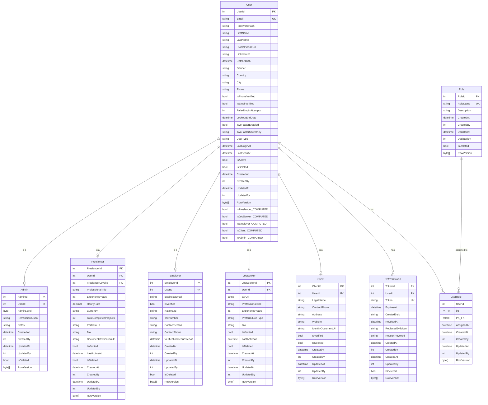

---

## 🏢 2. Company & Organization

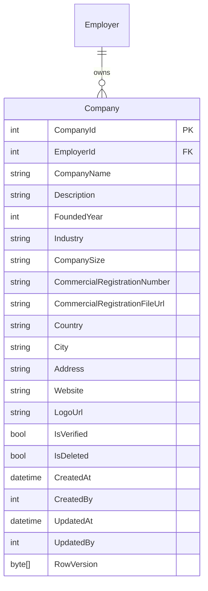

---

## 💼 3. Jobs & Applications

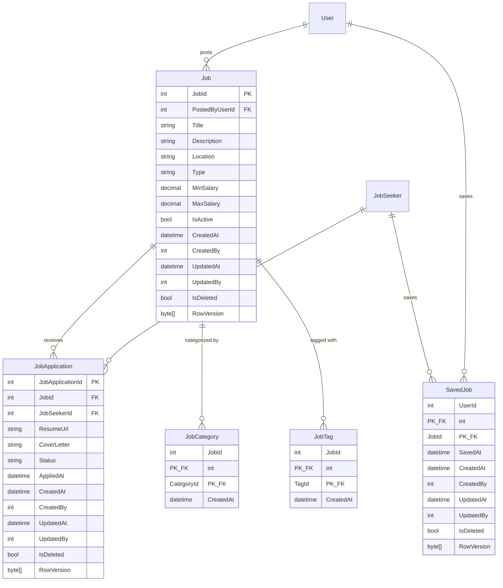

---

## 🎨 4. Projects & Contracts

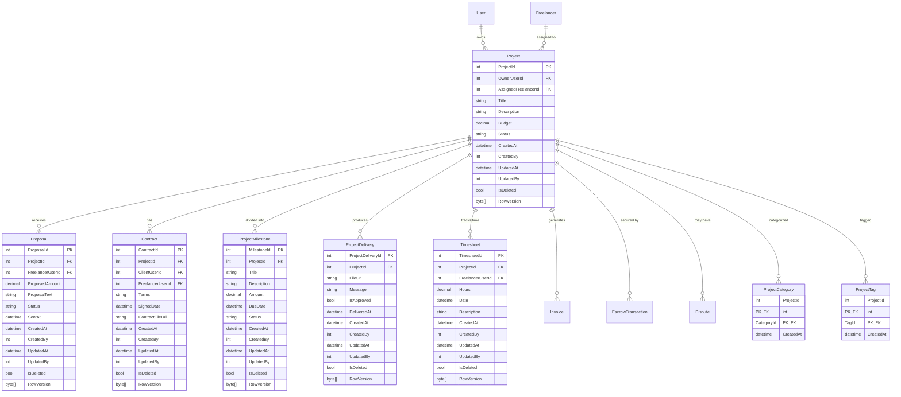

---

## 💰 5. Finance & Payments

```mermaid
erDiagram
    User ||--o{ Payment : "makes"
    User ||--o{ Subscription : "subscribes"
    User ||--o{ Transaction : "performs"
    User ||--o{ UserWallet : "owns"
    User ||--o{ WithdrawalRequest : "requests"
    User ||--o{ RefundRequest : "requests"
    Project ||--o{ Invoice : "has"
    Project ||--o{ EscrowTransaction : "secured"
    
    Payment {
        int PaymentId PK
        int UserId FK
        decimal Amount
        decimal FeeAmount
        string Currency
        string Status
        string TransactionId
        string PaymentProvider
        string GatewayResponse
        datetime CreatedAt
        int CreatedBy
        datetime UpdatedAt
        int UpdatedBy
        datetime CompletedAt
        bool IsDeleted
        byte[] RowVersion
    }

    Subscription {
        int SubscriptionId PK
        int UserId FK
        string PlanName
        decimal Price
        string Currency
        datetime StartDate
        datetime EndDate
        bool IsActive
        bool AutoRenew
        datetime RenewDate
        int MaxJobs
        int MaxProposals
        datetime CreatedAt
        int CreatedBy
        datetime UpdatedAt
        int UpdatedBy
        byte[] RowVersion
    }

    Transaction {
        int TransactionId PK
        int UserId FK
        string Type
        decimal Amount
        string Status
        string Description
        datetime CreatedAt
        int CreatedBy
        datetime UpdatedAt
        int UpdatedBy
        bool IsDeleted
        byte[] RowVersion
    }

    UserWallet {
        int WalletId PK
        int UserId FK
        decimal Balance
        string Currency
        datetime CreatedAt
        int CreatedBy
        datetime UpdatedAt
        int UpdatedBy
        bool IsDeleted
        byte[] RowVersion
    }

    Invoice {
        int InvoiceId PK
        int ProjectId FK
        decimal Amount
        datetime DueDate
        string Status
        string InvoiceNumber
        datetime CreatedAt
        int CreatedBy
        datetime UpdatedAt
        int UpdatedBy
        bool IsDeleted
        byte[] RowVersion
    }

    EscrowTransaction {
        int EscrowTransactionId PK
        int ProjectId FK
        int FreelancerUserId FK
        decimal Amount
        decimal FeeAmount
        string Currency
        string Status
        string PaymentProvider
        string GatewayResponse
        datetime CreatedAt
        int CreatedBy
        datetime UpdatedAt
        int UpdatedBy
        bool IsDeleted
        byte[] RowVersion
    }

    WithdrawalRequest {
        int WithdrawalRequestId PK
        int UserId FK
        decimal Amount
        string PaymentMethod
        string Status
        datetime RequestedAt
        datetime ProcessedAt
        datetime CreatedAt
        int CreatedBy
        datetime UpdatedAt
        int UpdatedBy
        bool IsDeleted
        byte[] RowVersion
    }

    RefundRequest {
        int RefundRequestId PK
        int UserId FK
        int TransactionId FK
        string Reason
        string Status
        datetime RequestedAt
        datetime CreatedAt
        int CreatedBy
        datetime UpdatedAt
        int UpdatedBy
        bool IsDeleted
        byte[] RowVersion
    }

    CommissionRate {
        int CommissionRateId PK
        string UserType
        decimal RatePercent
        datetime EffectiveDate
        datetime CreatedAt
        int CreatedBy
        datetime UpdatedAt
        int UpdatedBy
        bool IsDeleted
        byte[] RowVersion
    }

    PromoCode {
        int PromoCodeId PK
        string Code UK
        decimal DiscountPercent
        datetime ExpiryDate
        int UsageLimit
        datetime CreatedAt
        int CreatedBy
        datetime UpdatedAt
        int UpdatedBy
        bool IsDeleted
        byte[] RowVersion
    }
```

---

## ⭐ 6. Reviews, Ratings & Disputes

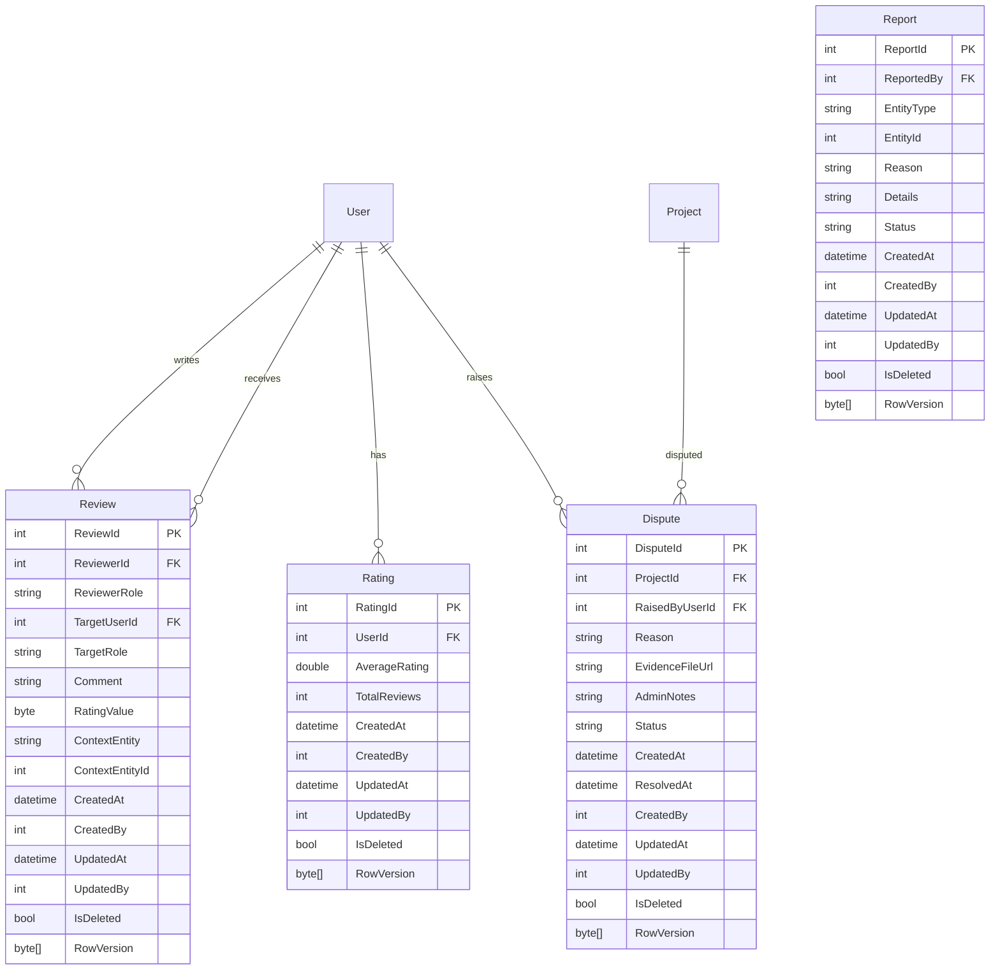

---

## 💬 7. Communication & Messaging

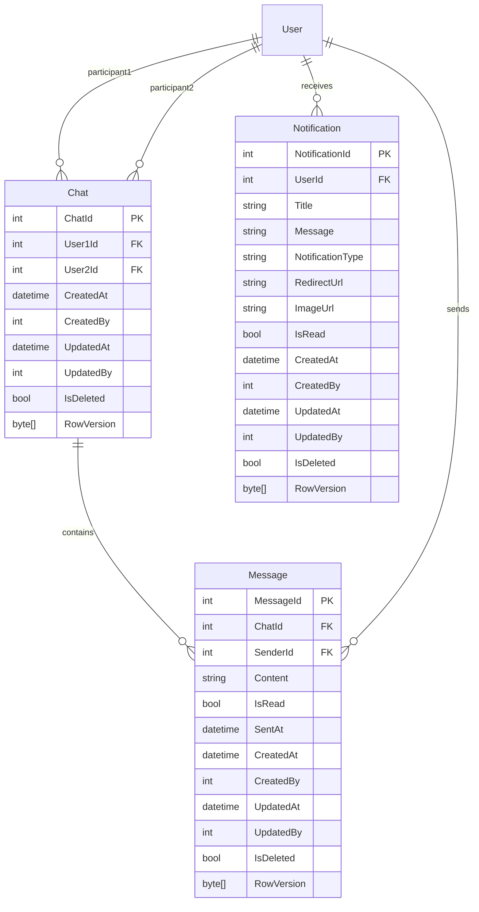

---

## 🎓 8. Community & Support

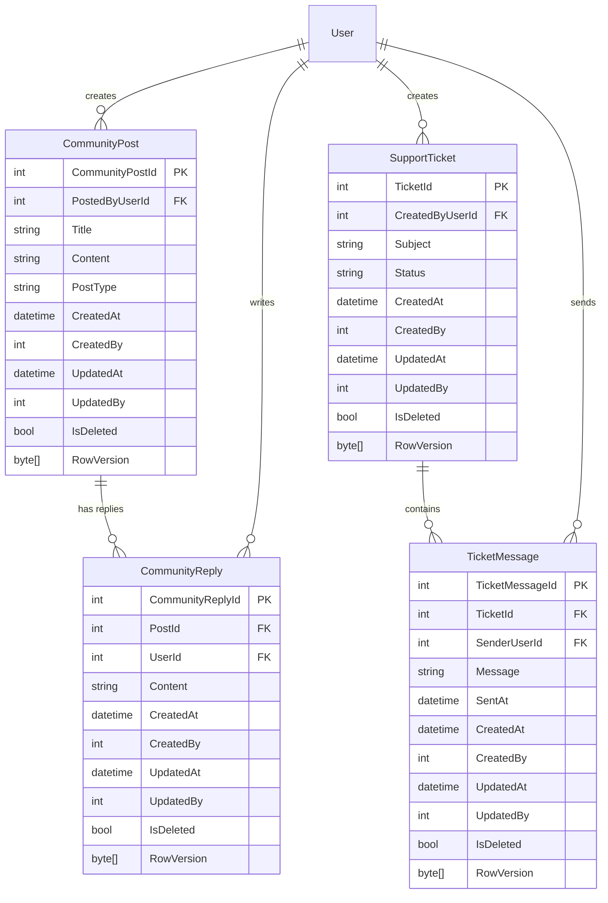

---

## 👤 9. User Profile & Documents

```mermaid
erDiagram
    User ||--o{ UserDocument : "uploads"
    User ||--o{ UserEducation : "has"
    User ||--o{ UserWorkExperience : "has"
    User ||--o{ UserCertification : "has"
    User ||--o{ UserSettings : "configures"
    Freelancer ||--o{ FreelancerPortfolio : "showcases"
    
    UserDocument {
        int DocumentId PK
        int UserId FK
        string DocumentType
        string FileUrl
        string Metadata
        bool IsVerified
        datetime UploadedAt
        datetime VerifiedAt
        int VerifiedBy
        datetime CreatedAt
        int CreatedBy
        datetime UpdatedAt
        int UpdatedBy
        bool IsDeleted
        byte[] RowVersion
    }

    UserEducation {
        int EducationId PK
        int UserId FK
        string Degree
        string Institution
        string FieldOfStudy
        datetime StartDate
        datetime EndDate
        string Description
        datetime CreatedAt
        int CreatedBy
        datetime UpdatedAt
        int UpdatedBy
        bool IsDeleted
        byte[] RowVersion
    }

    UserWorkExperience {
        int WorkExperienceId PK
        int UserId FK
        string JobTitle
        string Company
        datetime StartDate
        datetime EndDate
        string Description
        datetime CreatedAt
        int CreatedBy
        datetime UpdatedAt
        int UpdatedBy
        bool IsDeleted
        byte[] RowVersion
    }

    UserCertification {
        int CertificationId PK
        int UserId FK
        string CertificationName
        string IssuedBy
        datetime IssuedDate
        datetime ExpiryDate
        string CertificateUrl
        datetime CreatedAt
        int CreatedBy
        datetime UpdatedAt
        int UpdatedBy
        bool IsDeleted
        byte[] RowVersion
    }

    UserSettings {
        int UserId PK_FK
        string Language
        string TimeZone
        bool EmailNotifications
        bool SmsNotifications
        bool PushNotifications
        bool DarkMode
        string Preferences
        datetime CreatedAt
        int CreatedBy
        datetime UpdatedAt
        int UpdatedBy
        bool IsDeleted
        byte[] RowVersion
    }

    FreelancerPortfolio {
        int PortfolioId PK
        int FreelancerId FK
        string ProjectTitle
        string Description
        string ImageUrlsJson
        string ProjectUrl
        string ClientName
        datetime CreatedAt
        int CreatedBy
        datetime UpdatedAt
        int UpdatedBy
        bool IsDeleted
        byte[] RowVersion
    }
```

---

## 🏆 10. Skills, Badges & Levels

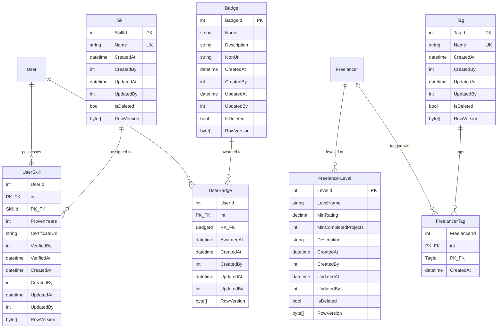

---

## 📂 11. Categories & Metadata

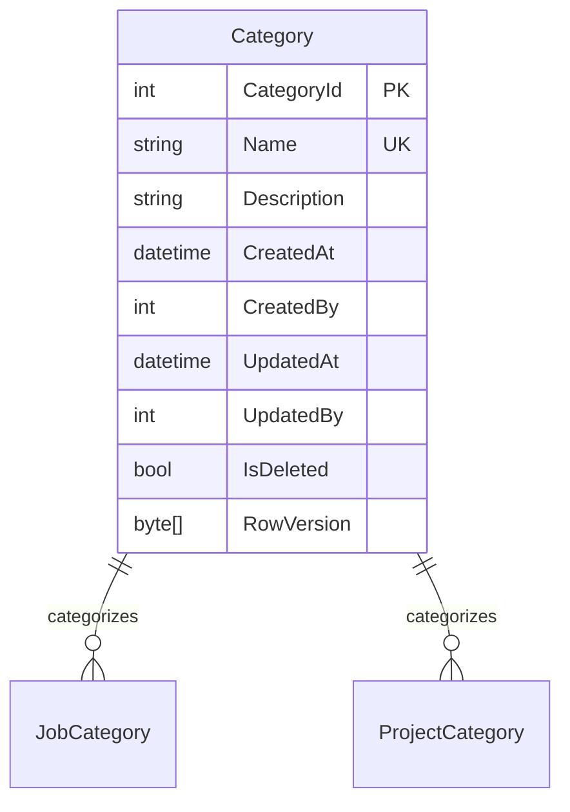

---

## 🔖 12. Saved & Favorites

```mermaid
erDiagram
    User ||--o{ SavedFreelancer : "saves"
    User ||--o{ Favorite : "favorites"
    
    SavedFreelancer {
        int UserId PK_FK
        int FreelancerUserId PK_FK
        datetime SavedAt
        datetime CreatedAt
        int CreatedBy
        datetime UpdatedAt
        int UpdatedBy
        bool IsDeleted
        byte[] RowVersion
    }

    Favorite {
        int UserId PK_FK
        string EntityType PK
        int EntityId PK
        datetime SavedAt
        datetime CreatedAt
        int CreatedBy
        datetime UpdatedAt
        int UpdatedBy
        bool IsDeleted
        byte[] RowVersion
    }
```

---

## 🎁 13. Marketing & Referrals

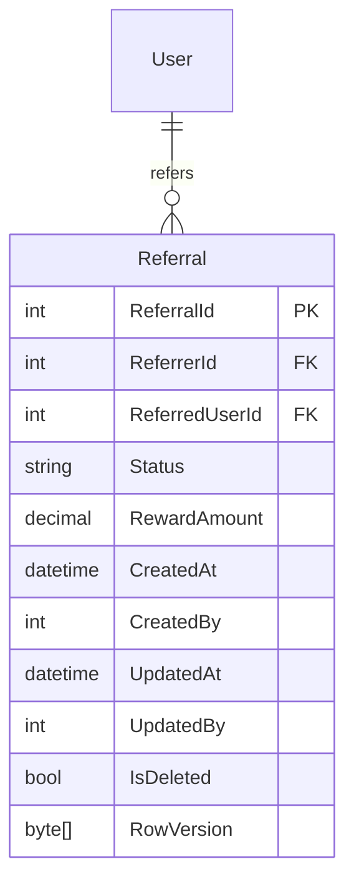

---

## 📊 14. System & Logs

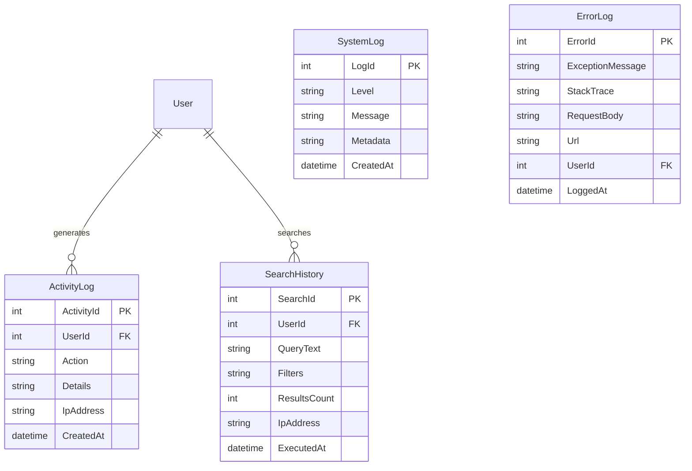

---

## 🛡️ 15. Security & Admin

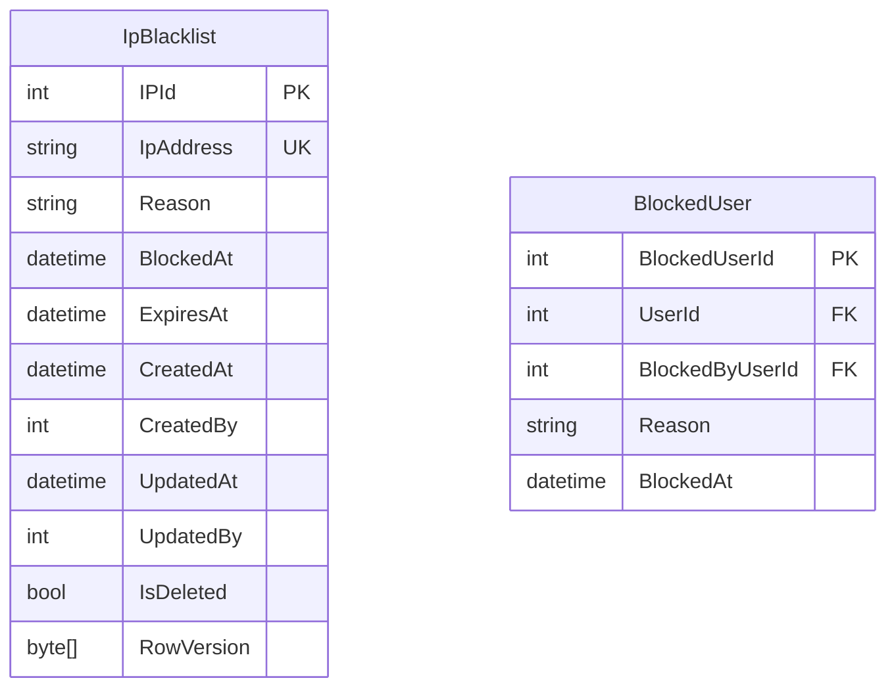

---

## 📧 16. Templates & Settings

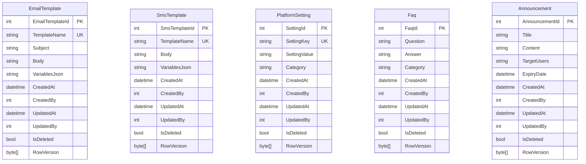

---

## 📋 Summary

### Total Entities: **72**
### Standard Audit Trail Fields (في كل كيان):
- `CreatedAt` (DateTimeOffset)
- `CreatedBy` (int?, nullable)
- `UpdatedAt` (DateTimeOffset?, nullable)
- `UpdatedBy` (int?, nullable)
- `IsDeleted` (bool)
- `RowVersion` (byte[], Timestamp)

### Key Features:
✅ Multi-role support (User can be Freelancer + JobSeeker + Employer simultaneously)  
✅ Soft Delete (IsDeleted)  
✅ Concurrency Control (RowVersion)  
✅ Complete Audit Trail  
✅ Comprehensive Relationships  
✅ Security & Validation
