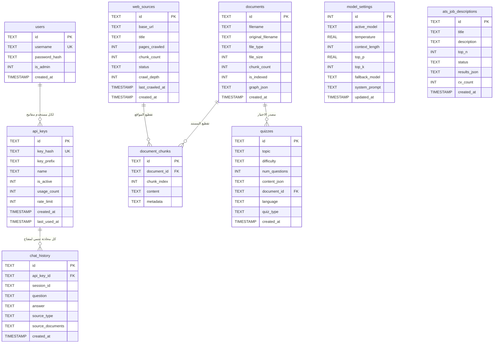

# MAESTA Chatbot — وثيقة المشروع الشاملة

> **ملف مرجعي للذكاء الاصطناعي والمطورين** — يشرح بنية المشروع بالكامل، وما تم إنجازه، وكيف تعمل الأنظمة الداخلية.

---

## 1. نظرة عامة على المشروع

**MAESTA** هو نظام شات بوت ذكي متكامل يعمل على Flask، مبني بأسلوب **Multi-Agent LangGraph** يدعم:

| الوحدة | المسار | الوظيفة |
|--------|--------|---------|
| **Agent** | `services/agent/` | نظام الوكيل الذكي: LangGraph Supervisor + RAG + Chat + Quiz |
| **Chatbot** | `chatbot/` | Flask Routes: Auth, Admin Dashboard, Public REST API |
| **Quiz** | `services/quiz/` | توليد اختبارات احترافية بـ 5 مراحل (TeacherQuizService) |
| **CVs/ATS** | `services/cvs/` | نظام تتبع المتقدمين (ATS): فهرسة السيرات الذاتية وترتيبها |

- **Entry Point**: `main.py` ← Flask App Factory
- **Database**: SQLite (`models/database.py`) — raw SQL
- **Vector Store**: FAISS (محلي) + pgvector (اختياري)
- **LLM**: Ollama (محلي) + Gemini Flash (Cloud) + Claude (Fallback)
- **Embedding**: `sentence-transformers` (all-MiniLM-L6-v2) أو Nomic via Ollama

---

## 2. بنية المجلدات

```
MAESTA-chat-bot/
├── main.py                    # Flask App Factory — نقطة البداية
├── config.py                  # كل الإعدادات (paths, models, FAISS dims...)
├── AGENTS.md                  # قواعد العمل للـ AI Agents
│
├── models/
│   └── database.py            # SQLite schema + كل دوال الـ DB
│
├── services/
│   ├── agent/                 # نظام الوكيل الذكي الكامل
│   │   ├── supervisor.py      # Router: يوجه الطلبات لـ RAG / CHAT / QUIZ
│   │   ├── agents/
│   │   │   ├── rag_graph.py   # RAG Agent (LangGraph)
│   │   │   ├── chat_agent.py  # Chat Agent (ReAct loop)
│   │   │   └── quiz_agent.py  # Quiz Agent
│   │   ├── rag/
│   │   │   ├── knowledge_base.py  # Vector DB: FAISS + BM25 Hybrid Search
│   │   │   └── vector_backend.py  # Abstraction: FAISS / pgvector / Chroma
│   │   ├── llm/
│   │   │   └── dual_llm_orchestrator.py  # Ollama (Local) + Claude (Cloud)
│   │   ├── memory/            # Session Memory (per-conversation)
│   │   ├── tools/             # LangGraph Tools
│   │   ├── pipelines/
│   │   │   └── chat_router.py # Main chat entry point
│   │   ├── actions/           # Business Actions (connectors, onboarding)
│   │   └── ollama_service.py  # Ollama HTTP Client
│   │
│   ├── cvs/
│   │   └── ats_pipeline.py    # ATS Service: فهرسة + بحث + ترتيب CVs
│   │
│   └── quiz/
│       └── teacher_quizzes_pipeline.py  # 5-Stage Quiz Generator
│
├── chatbot/
│   └── routes/
│       ├── admin_ai.py        # Admin AI Routes (connectors, RAG, quiz, ATS)
│       └── ...
│
├── controllers/               # MVC Controllers (register blueprints)
├── templates/                 # Jinja2 HTML templates
│   └── admin/ai/              # Admin AI dashboard pages
├── static/                    # CSS, JS, images
├── core/
│   ├── logger.py              # Centralized logging
│   ├── exceptions.py          # Custom exceptions
│   └── sentry_init.py         # Sentry error tracking
└── configs/                   # YAML/JSON config files
```

---

## 3. قاعدة البيانات (SQLite)



### جداول مستقلة (ليست في SQLite):
- **FAISS Index** (`data/vector_store/faiss_index.bin`) — الـ Knowledge Base
- **ATS FAISS Index** (`data/vector_store/ats_faiss_index.bin`) — السيرات الذاتية منفصلة

---

## 4. نظام RAG — كيف يعمل

```
المستخدم يرسل سؤال
        │
        ▼
┌─────────────────────┐
│   Supervisor Agent  │  ← LangGraph Router
│   (supervisor.py)   │     يقرر: RAG أم CHAT؟
└─────────────────────┘
        │
        │ [RAG]
        ▼
┌──────────────────────────────────────────────────┐
│              RAG Graph (rag_graph.py)             │
│                                                   │
│  1. retrieve_node                                 │
│     ├── Vector Search (FAISS/pgvector)  70%       │
│     └── Keyword Search (BM25)           30%       │
│     → Hybrid Fusion → Top-K Chunks               │
│     → Multi-Tenant Filter (tenant/site/bot)       │
│                                                   │
│  2. grade_documents_node                          │
│     → LLM grades each chunk (relevant/not)        │
│                                                   │
│  3. generate_node                                 │
│     → LLM builds answer from relevant chunks      │
│     → Returns answer + source_documents           │
│                                                   │
│  4. [Optional] web_search_node                    │
│     → If no relevant docs found → search web      │
└──────────────────────────────────────────────────┘
        │
        ▼
   الإجابة للمستخدم

--- مسار الفهرسة ---

Admin يرفع PDF/URL
        │
        ▼
┌──────────────────────────┐
│  Document Processor       │
│  - Extract Text (pymupdf)│
│  - Chunk Text             │
│    (size=1000, overlap=200│
│  - Add Metadata           │
│    {tenant_id, site_id,   │
│     bot_id, source}       │
└──────────────────────────┘
        │
        ▼
┌──────────────────────────┐
│  Embedding Model          │
│  sentence-transformers    │
│  OR Nomic via Ollama      │
│  → 768-dim vectors        │
└──────────────────────────┘
        │
        ▼
┌──────────────────────────┐
│  FAISS IndexFlatL2        │
│  + SQLite document_chunks │
│  + BM25 Okapi index       │
└──────────────────────────┘
```

### تفاصيل Hybrid Search:
| المكون | النسبة | الوصف |
|--------|--------|--------|
| Vector Search (FAISS) | 70% | تشابه دلالي عبر embeddings |
| BM25 Keyword Search | 30% | مطابقة الكلمات المفتاحية |
| Post-Filter | — | فلتر متعدد المستأجرين (Fail-Closed) |

---

## 5. نظام ATS — كيف يعمل

```
Admin يرفع CVs (PDF)
        │
        ▼
┌──────────────────────────────────────────┐
│         ATSService.index_cv_files()       │
│                                           │
│  لكل CV:                                  │
│  1. Extract Text (pdfminer → PyPDF2)      │
│  2. Chunk Text (size=1000, overlap=200)   │
│  3. spaCy NER: استخراج الاسم/شركات/مواقع │
│  4. Embed Chunks → FAISS ATS Index        │
│     (منفصل عن الـ Knowledge Base)         │
│  5. Save metadata (filename, name, etc.)  │
└──────────────────────────────────────────┘
        │
        ▼
Admin يدخل Job Description
        │
        ▼
┌──────────────────────────────────────────┐
│      ATSService.search_top_candidates()   │
│                                           │
│  1. Embed Job Description                 │
│  2. FAISS Search → Top-10 chunks          │
│  3. تجميع النتائج per CV                  │
│  4. Max-Pool: أعلى chunk score لكل CV     │
│  5. Scale Scores:                         │
│     raw [0.58→0.82] → human [10%→95%]    │
│  6. Sort Descending                       │
└──────────────────────────────────────────┘
        │
        ▼
┌──────────────────────────────────────────┐
│      LLM Re-Ranking (Ollama)              │
│                                           │
│  يأخذ Top-10 ويطلب من LLM:               │
│  - اختار أفضل top_n مرشحين               │
│  - أعطي reasoning لكل مرشح              │
│  - Structured Output (JSON)               │
└──────────────────────────────────────────┘
        │
        ▼
نتائج مرتبة مع نسب تطابق وأسباب
```

---

## 6. نظام توليد الاختبارات (TeacherQuizService)

```
5 مراحل متسلسلة (5 LLM Calls):

Stage 1: Deep Analysis
  Input: نص المادة العلمية
  Output: المواضيع، الأهداف، Bloom's Taxonomy mapping

Stage 2: Blueprint
  Output: توزيع الأسئلة، منحنى الصعوبة، أنواع الأسئلة

Stage 3: Question Crafting
  Output: أسئلة MCQ ثنائية اللغة مع distractors ذكية

Stage 4: Self-Review
  Output: نقد وإصلاح الأسئلة الضعيفة/المتحيزة

Stage 5: Final Output
  Output: امتحان Markdown + مفتاح إجابات + JSON نظيف
```

---

## 7. نظام الـ LLM (Dual Orchestrator)

```
dual_llm_orchestrator.py:

              ┌─────────────────┐
              │ DualLLMOrchest. │
              └─────────────────┘
                    │        │
         ┌──────────┘        └──────────┐
         ▼                              ▼
┌─────────────────┐            ┌─────────────────┐
│  Local (Ollama) │            │  Cloud (Claude/  │
│  - Fast         │            │   Gemini)        │
│  - Private      │            │  - Complex tasks │
│  - Always on    │            │  - Fallback      │
└─────────────────┘            └─────────────────┘
```

---

## 8. Multi-Tenant Architecture

كل قطعة بيانات في الـ RAG مربوطة بـ:
- `tenant_id` — المؤسسة
- `site_id` — الموقع/المشروع
- `bot_id` — البوت المحدد

الفلتر **Fail-Closed**: أي chunk بدون metadata كاملة يُرفض تلقائياً.

---

## 9. الـ APIs المتاحة

| Endpoint | Method | الوظيفة |
|----------|--------|---------|
| `/api/v1/chat` | POST | Chat مع البوت |
| `/api/v1/health` | GET | فحص صحة النظام |
| `/admin/` | GET | لوحة التحكم |
| `/admin/ai/documents` | GET/POST | إدارة المستندات |
| `/admin/ai/knowledge-base` | GET | فهرس المعرفة |
| `/admin/ai/quiz/generate` | POST | توليد اختبار |
| `/admin/ai/ats/jobs` | GET/POST | إدارة وظائف ATS |
| `/admin/ai/connectors` | GET/POST | موصلات خارجية |

---

## 10. التقنيات المستخدمة

| التقنية | الإصدار | الدور |
|---------|---------|------|
| Flask | 3.x | Web Framework |
| LangGraph | latest | Agent Orchestration |
| LangChain | latest | LLM Abstractions |
| FAISS | latest | Vector Search |
| sentence-transformers | latest | Local Embeddings |
| Ollama | latest | Local LLM Server |
| SQLite | built-in | Database |
| rank_bm25 | latest | Keyword Search |
| spaCy | latest | NER for ATS |
| pdfminer | latest | PDF Extraction |
| Sentry | latest | Error Tracking |

---

## 11. ما تم إنجازه حتى الآن ✅

- [x] نظام RAG كامل مع Hybrid Search (FAISS + BM25)
- [x] Multi-Tenant Security (Fail-Closed filter)
- [x] ATS System: فهرسة CVs + ترتيب بالـ embeddings + LLM re-ranking
- [x] TeacherQuizService: 5-stage professional quiz generation
- [x] Dual LLM Orchestrator (Ollama Local + Claude Cloud)
- [x] Admin Dashboard مع واجهات كاملة
- [x] Connectors Management (موصلات خارجية)
- [x] Chat History + Session Memory
- [x] API Keys Management مع Rate Limiting
- [x] Web Crawler (crawl URLs into knowledge base)
- [x] Knowledge Graph extraction per document
- [x] Sentry Error Tracking
- [x] Background re-indexing (non-blocking startup)

---

## 12. كيفية التشغيل

```bash
# Install dependencies
pip install -r requirements.txt

# Run Ollama (in separate terminal)
ollama serve

# Run the app
python main.py

# Dashboard
http://localhost:5000/admin
# Username: admin | Password: admin123
```

---

*آخر تحديث: مايو 2026 — MAESTA v2.0*
