# 📊 تقرير معماري شامل — MAESTA-chat-bot

> **تاريخ التقرير:** 14 يونيو 2026  
> **إجمالي الملفات:** 100+ Python, 42 HTML/CSS/JS  
> **قواعد البيانات:** chatbot.db (50+ جدول) + ai_storage.db (14 جدول)

---

## 📑 فهرس المحتويات

1. [الهيكل العام للمشروع](#1-الهيكل-العام-للمشروع)
2. [نظام الـ Supervisor — التوجيه الذكي](#2-نظام-الـ-supervisor--التوجيه-الذكي)
3. [RAG Graph — 6 Nodes Pipeline](#3-rag-graph--6-nodes-pipeline)
4. [نظام المقابلات — Interview Pipeline (17 Node)](#4-نظام-المقابلات--interview-pipeline-17-node)
5. [نظام تقييم الإجابات — Hybrid Scoring](#5-نظام-تقييم-الإجابات--hybrid-scoring)
6. [أوزان التقييم النهائي](#6-أوزان-التقييم-النهائي)
7. [نظام ATS — Applicant Tracking System](#7-نظام-ats--applicant-tracking-system)
8. [نظام Quiz — 5 مراحل أكاديمية](#8-نظام-quiz--5-مراحل-أكاديمية)
9. [Dual-LLM Orchestrator — Draft & Verify](#9-dual-llm-orchestrator--draft--verify)
10. [أنظمة الأمان — Anti-Cheat & Consistency](#10-أنظمة-الأمان--anti-cheat--consistency)
11. [Action Engine — Phase 7](#11-action-engine--phase-7)
12. [قاعدة البيانات — Database Schema](#12-قاعدة-البيانات--database-schema)
13. [Redis Cache Layer](#13-redis-cache-layer)
14. [خريطة التكامل بين المكونات](#14-خريطة-التكامل-بين-المكونات)
15. [جميع الأوزان والقيم الثابتة](#15-جميع-الأوزان-والقيم-الثابتة)
16. [AI Storage — ai_storage.db](#16-ai-storage--ai_storagedb)
17. [خريطة المسارات — All Flask Routes](#17-خريطة-المسارات--all-flask-routes)
18. [Admin UI — جميع القوالب](#18-admin-ui--جميع-القوالب)

---

## 1. الهيكل العام للمشروع

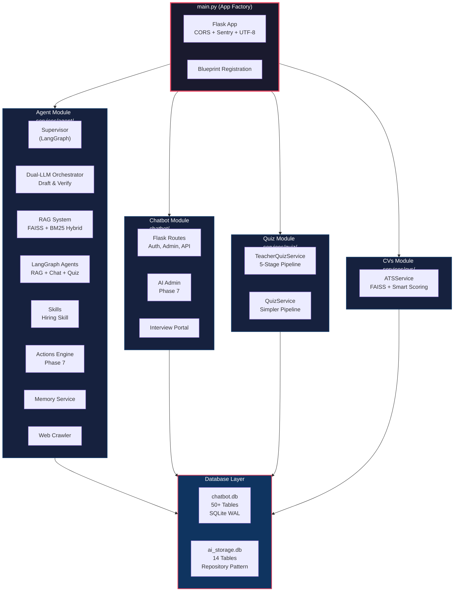
```mermaid
flowchart TD
    subgraph Main["main.py (App Factory)"]
        M1["Flask App<br/>CORS + Sentry + UTF-8"]
        M2["Blueprint Registration"]
    end

    subgraph Agent["Agent Module<br/>services/agent/"]
        A1["Supervisor<br/>(LangGraph)"]
        A2["Dual-LLM Orchestrator<br/>Draft & Verify"]
        A3["RAG System<br/>FAISS + BM25 Hybrid"]
        A4["LangGraph Agents<br/>RAG + Chat + Quiz"]
        A5["Skills<br/>Hiring Skill"]
        A6["Actions Engine<br/>Phase 7"]
        A7["Memory Service"]
        A8["Web Crawler"]
    end

    subgraph Chatbot["Chatbot Module<br/>chatbot/"]
        C1["Flask Routes<br/>Auth, Admin, API"]
        C2["AI Admin<br/>Phase 7"]
        C3["Interview Portal"]
    end

    subgraph Quiz["Quiz Module<br/>services/quiz/"]
        Q1["TeacherQuizService<br/>5-Stage Pipeline"]
        Q2["QuizService<br/>Simpler Pipeline"]
    end

    subgraph CVs["CVs Module<br/>services/cvs/"]
        V1["ATSService<br/>FAISS + Smart Scoring"]
    end

    subgraph DB["Database Layer"]
        D1["chatbot.db<br/>50+ Tables<br/>SQLite WAL"]
        D2["ai_storage.db<br/>14 Tables<br/>Repository Pattern"]
    end

    Main --> Agent
    Main --> Chatbot
    Main --> Quiz
    Main --> CVs
    Agent --> DB
    Chatbot --> DB
    Quiz --> DB
    CVs --> DB

    style Main fill:#1a1a2e,stroke:#e94560,stroke-width:3px,color:#fff
    style Agent fill:#16213e,stroke:#0f3460,stroke-width:2px,color:#fff
    style Chatbot fill:#16213e,stroke:#0f3460,stroke-width:2px,color:#fff
    style Quiz fill:#16213e,stroke:#0f3460,stroke-width:2px,color:#fff
    style CVs fill:#16213e,stroke:#0f3460,stroke-width:2px,color:#fff
    style DB fill:#0f3460,stroke:#e94560,stroke-width:2px,color:#fff
```

---

## 2. نظام الـ Supervisor — التوجيه الذكي

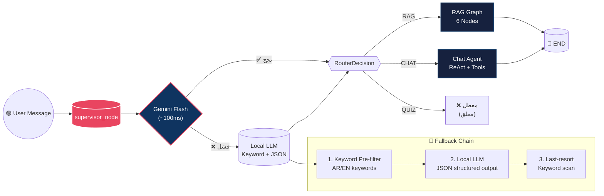
```mermaid
flowchart LR
    START(("🟢 User Message")) --> SN[("supervisor_node")]
    
    SN --> GEMINI{"Gemini Flash<br/>(~100ms)"}
    GEMINI -- "✅ نجح" --> DECISION{{"RouterDecision"}}
    GEMINI -- "❌ فشل" --> LOCAL[("Local LLM<br/>Keyword + JSON")]
    LOCAL --> DECISION

    DECISION -- "RAG" --> RAG["RAG Graph<br/>6 Nodes"]
    DECISION -- "CHAT" --> CHAT["Chat Agent<br/>ReAct + Tools"]
    DECISION -- "QUIZ" --> QUIZ_X["❌ معطل<br/>(معلق)"]

    RAG --> END[("🏁 END")]
    CHAT --> END

    subgraph Fallback["🔄 Fallback Chain"]
        LOCAL1["1. Keyword Pre-filter<br/>AR/EN keywords"]
        LOCAL2["2. Local LLM<br/>JSON structured output"]
        LOCAL3["3. Last-resort<br/>Keyword scan"]
    end
    LOCAL --> LOCAL1
    LOCAL1 --> LOCAL2
    LOCAL2 --> LOCAL3

    style SN fill:#e94560,stroke:#fff,stroke-width:2px,color:#fff
    style GEMINI fill:#0f3460,stroke:#e94560,stroke-width:2px,color:#fff
    style RAG fill:#16213e,stroke:#0f3460,stroke-width:2px,color:#fff
    style CHAT fill:#16213e,stroke:#0f3460,stroke-width:2px,color:#fff
```

---

## 3. RAG Graph — 6 Nodes Pipeline

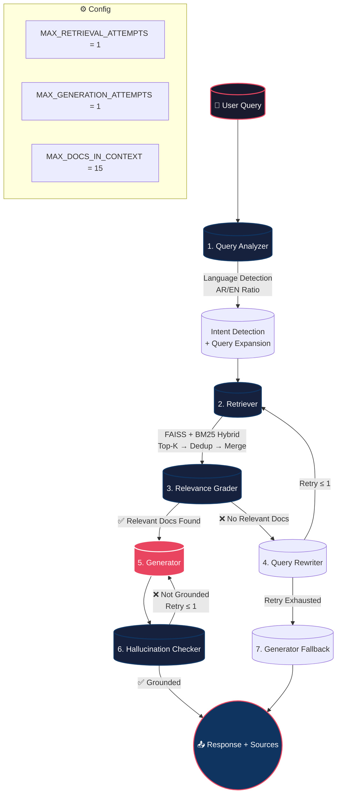
```mermaid
flowchart TD
    Q[("💬 User Query")] --> QA[("1. Query Analyzer")]
    
    QA --> |"Language Detection<br/>AR/EN Ratio"| QA_OUT
    QA_OUT[("Intent Detection<br/>+ Query Expansion")] --> RET[("2. Retriever")]
    
    RET --> |"FAISS + BM25 Hybrid<br/>Top-K → Dedup → Merge"| RG[("3. Relevance Grader")]
    
    RG --> |"✅ Relevant Docs Found"| GEN[("5. Generator")]
    RG --> |"❌ No Relevant Docs"| RW[("4. Query Rewriter")]
    
    RW --> |"Retry ≤ 1"| RET
    RW --> |"Retry Exhausted"| GF[("7. Generator Fallback")]
    
    GEN --> HC[("6. Hallucination Checker")]
    HC --> |"✅ Grounded"| RESP(("📤 Response + Sources"))
    HC --> |"❌ Not Grounded<br/>Retry ≤ 1"| GEN
    
    GF --> RESP

    subgraph Config["⚙️ Config"]
        C1["MAX_RETRIEVAL_ATTEMPTS = 1"]
        C2["MAX_GENERATION_ATTEMPTS = 1"]
        C3["MAX_DOCS_IN_CONTEXT = 15"]
    end

    style Q fill:#1a1a2e,stroke:#e94560,stroke-width:2px,color:#fff
    style QA fill:#16213e,stroke:#0f3460,stroke-width:2px,color:#fff
    style RET fill:#16213e,stroke:#0f3460,stroke-width:2px,color:#fff
    style RG fill:#16213e,stroke:#0f3460,stroke-width:2px,color:#fff
    style GEN fill:#e94560,stroke:#fff,stroke-width:2px,color:#fff
    style HC fill:#16213e,stroke:#0f3460,stroke-width:2px,color:#fff
    style RESP fill:#0f3460,stroke:#e94560,stroke-width:2px,color:#fff
```

### Query Analyzer — تفصيل

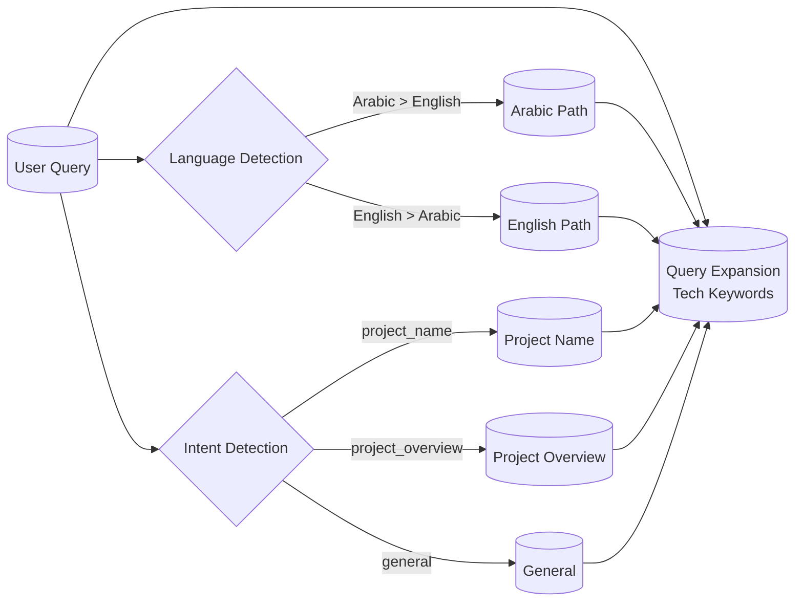
```mermaid
flowchart LR
    Q[("User Query")] --> LANG{"Language Detection"}
    LANG --> |"Arabic > English"| AR[("Arabic Path")]
    LANG --> |"English > Arabic"| EN[("English Path")]
    
    Q --> INT{"Intent Detection"}
    INT --> |"project_name"| PN[("Project Name")]
    INT --> |"project_overview"| PO[("Project Overview")]
    INT --> |"general"| GN[("General")]
    
    Q --> EXP[("Query Expansion<br/>Tech Keywords")]
    
    AR --> EXP
    EN --> EXP
    PN --> EXP
    PO --> EXP
    GN --> EXP
```

---

## 4. نظام المقابلات — Interview Pipeline (17 Node)

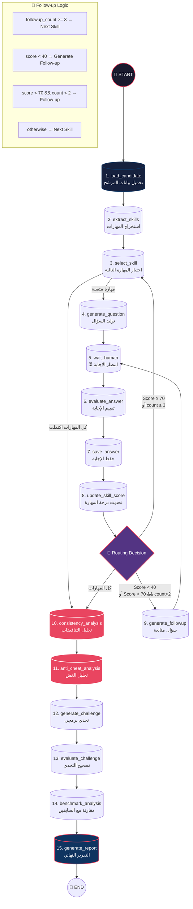
```mermaid
flowchart TD
    START(("🏁 START")) --> LC[("1. load_candidate<br/>تحميل بيانات المرشح")]
    LC --> ES[("2. extract_skills<br/>استخراج المهارات")]
    ES --> SS[("3. select_skill<br/>اختيار المهارة التالية")]
    
    SS --> |"مهارة متبقية"| GQ[("4. generate_question<br/>توليد السؤال")]
    SS --> |"كل المهارات اكتملت"| CA
    
    GQ --> WH[("5. wait_human<br/>⏳ انتظار الإجابة")]
    WH --> EA[("6. evaluate_answer<br/>تقييم الإجابة")]
    EA --> SA[("7. save_answer<br/>حفظ الإجابة")]
    SA --> US[("8. update_skill_score<br/>تحديث درجة المهارة")]
    
    US --> ROUTE{"🏓 Routing Decision"}
    
    ROUTE --> |"Score < 40<br/>أو Score < 70 && count<2"| GFQ[("9. generate_followup<br/>سؤال متابعة")]
    GFQ --> WH
    
    ROUTE --> |"Score ≥ 70<br/>أو count ≥ 3"| SS
    
    ROUTE --> |"كل المهارات"| CA[("10. consistency_analysis<br/>تحليل التناقضات")]
    
    CA --> AC[("11. anti_cheat_analysis<br/>تحليل الغش")]
    AC --> GC[("12. generate_challenge<br/>تحدي برمجي")]
    GC --> EC[("13. evaluate_challenge<br/>تصحيح التحدي")]
    EC --> BA[("14. benchmark_analysis<br/>مقارنة مع السابقين")]
    BA --> GR[("15. generate_report<br/>التقرير النهائي")]
    GR --> ENDD(("🏁 END"))
    
    subgraph FollowupLogic["🔁 Follow-up Logic"]
        F1["followup_count >= 3 → Next Skill"]
        F2["score < 40 → Generate Follow-up"]
        F3["score < 70 && count < 2 → Follow-up"]
        F4["otherwise → Next Skill"]
    end

    style START fill:#1a1a2e,stroke:#e94560,stroke-width:2px,color:#fff
    style LC fill:#16213e,stroke:#0f3460,stroke-width:2px,color:#fff
    style CA fill:#e94560,stroke:#fff,stroke-width:2px,color:#fff
    style AC fill:#e94560,stroke:#fff,stroke-width:2px,color:#fff
    style GR fill:#0f3460,stroke:#e94560,stroke-width:2px,color:#fff
    style ROUTE fill:#533483,stroke:#e94560,stroke-width:2px,color:#fff
```

### تدفق المقابلة — خرائط الحالات

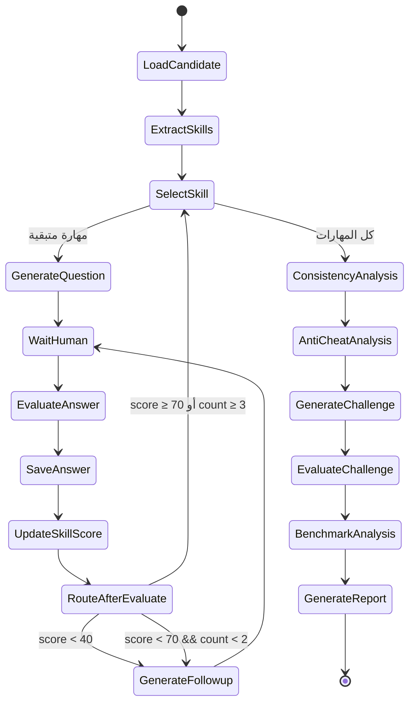
```mermaid
stateDiagram-v2
    [*] --> LoadCandidate
    LoadCandidate --> ExtractSkills
    ExtractSkills --> SelectSkill
    
    state SelectSkill <<choice>>
    SelectSkill --> GenerateQuestion: مهارة متبقية
    SelectSkill --> ConsistencyAnalysis: كل المهارات
    
    GenerateQuestion --> WaitHuman
    WaitHuman --> EvaluateAnswer
    EvaluateAnswer --> SaveAnswer
    SaveAnswer --> UpdateSkillScore
    UpdateSkillScore --> RouteAfterEvaluate
    
    state RouteAfterEvaluate <<choice>>
    RouteAfterEvaluate --> GenerateFollowup: score < 40
    RouteAfterEvaluate --> GenerateFollowup: score < 70 && count < 2
    RouteAfterEvaluate --> SelectSkill: score ≥ 70 أو count ≥ 3
    
    GenerateFollowup --> WaitHuman
    
    ConsistencyAnalysis --> AntiCheatAnalysis
    AntiCheatAnalysis --> GenerateChallenge
    GenerateChallenge --> EvaluateChallenge
    EvaluateChallenge --> BenchmarkAnalysis
    BenchmarkAnalysis --> GenerateReport
    GenerateReport --> [*]
```

---

## 5. نظام تقييم الإجابات — Hybrid Scoring

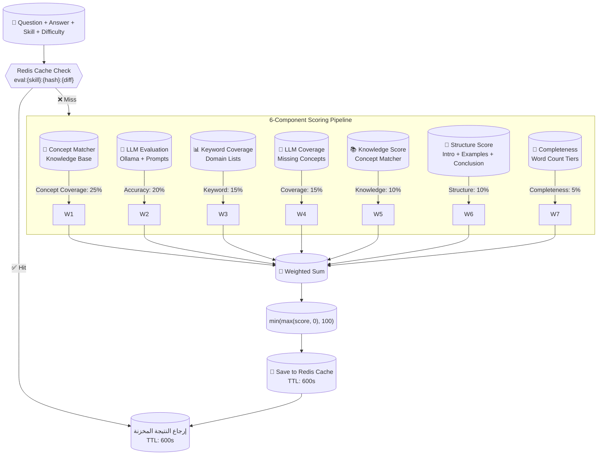
```mermaid
flowchart TD
    INPUT[("📝 Question + Answer + Skill + Difficulty")] --> CACHE{{"Redis Cache Check<br/>eval:{skill}:{hash}:{diff}"}}
    
    CACHE --> |"❌ Miss"| PIPELINE
    CACHE --> |"✅ Hit"| RETURN[("إرجاع النتيجة المخزنة<br/>TTL: 600s")]
    
    subgraph PIPELINE["6-Component Scoring Pipeline"]
        CM[("🧠 Concept Matcher<br/>Knowledge Base")]
        CM --> |"Concept Coverage: 25%"| W1
        
        LLM[("🤖 LLM Evaluation<br/>Ollama + Prompts")]
        LLM --> |"Accuracy: 20%"| W2
        
        KC[("📊 Keyword Coverage<br/>Domain Lists")]
        KC --> |"Keyword: 15%"| W3
        
        LLM2[("🤖 LLM Coverage<br/>Missing Concepts")]
        LLM2 --> |"Coverage: 15%"| W4
        
        KN[("📚 Knowledge Score<br/>Concept Matcher")]
        KN --> |"Knowledge: 10%"| W5
        
        ST[("📐 Structure Score<br/>Intro + Examples + Conclusion")]
        ST --> |"Structure: 10%"| W6
        
        CP[("📏 Completeness<br/>Word Count Tiers")]
        CP --> |"Completeness: 5%"| W7
    end
    
    W1 --> COMBINE
    W2 --> COMBINE
    W3 --> COMBINE
    W4 --> COMBINE
    W5 --> COMBINE
    W6 --> COMBINE
    W7 --> COMBINE
    
    COMBINE[("🔢 Weighted Sum")] --> CLAMP[("min(max(score, 0), 100)")]
    CLAMP --> CACHE_SAVE[("💾 Save to Redis Cache<br/>TTL: 600s")]
    CACHE_SAVE --> RETURN
```

### توزيع درجات التقييم

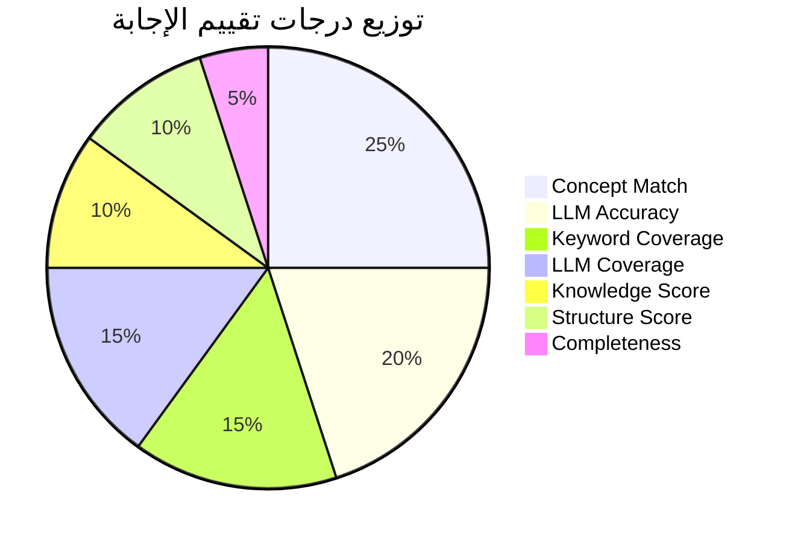
```mermaid
pie title توزيع درجات تقييم الإجابة
    "Concept Match" : 25
    "LLM Accuracy" : 20
    "Keyword Coverage" : 15
    "LLM Coverage" : 15
    "Knowledge Score" : 10
    "Structure Score" : 10
    "Completeness" : 5
```

### مستويات طول الإجابة

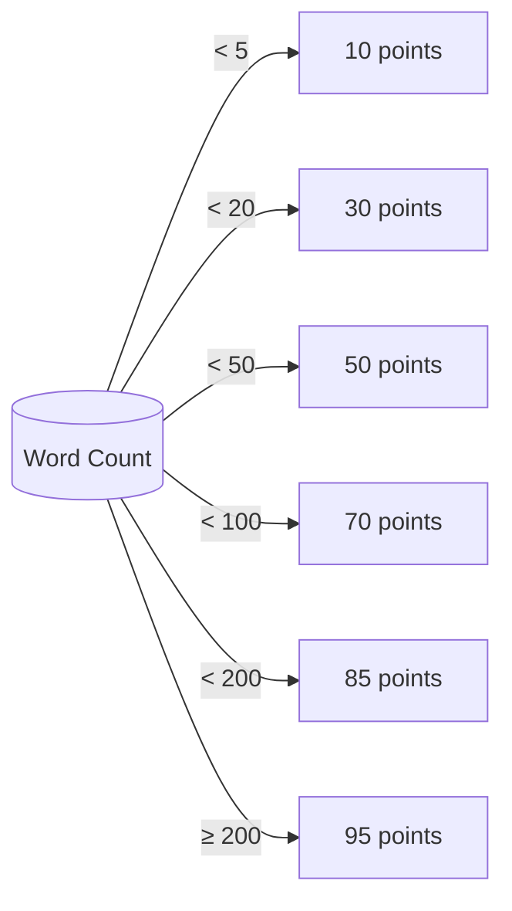
```mermaid
flowchart LR
    WC[("Word Count")] --> |"< 5"| TIER1["10 points"]
    WC --> |"< 20"| TIER2["30 points"]
    WC --> |"< 50"| TIER3["50 points"]
    WC --> |"< 100"| TIER4["70 points"]
    WC --> |"< 200"| TIER5["85 points"]
    WC --> |"≥ 200"| TIER6["95 points"]
```

### بنية التقييم — علامات البنية

| العلامة | الكلمات المفتاحية | النقاط |
|---------|-------------------|--------|
| Intro | "first", "there are", "several", "basically" | 30 |
| Examples | "for example", "for instance", "such as", "like when" | 40 |
| Conclusion | "in summary", "overall", "finally", "in conclusion", "therefore" | 30 |

---

## 6. أوزان التقييم النهائي

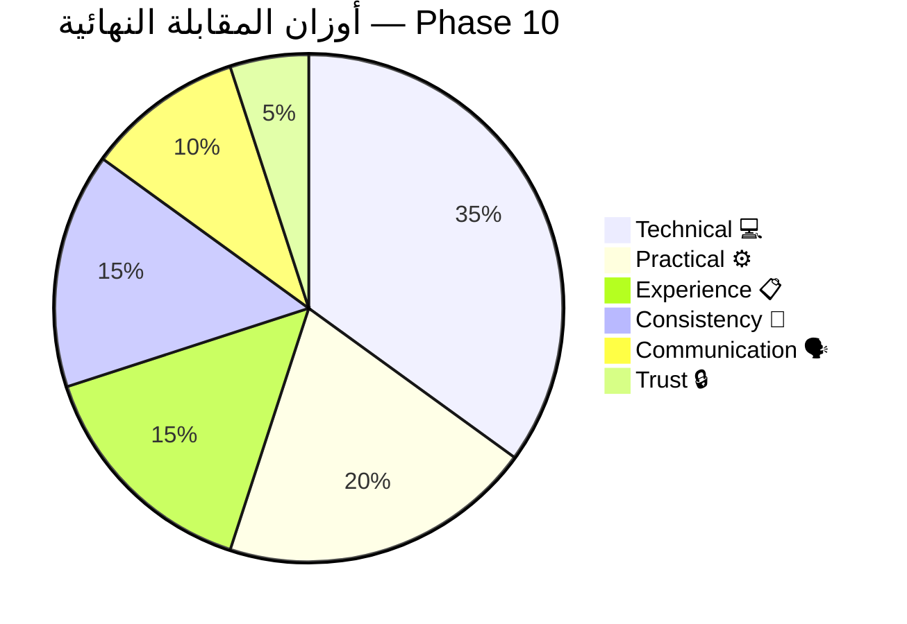
```mermaid
pie title أوزان المقابلة النهائية — Phase 10
    "Technical 💻" : 35
    "Practical ⚙️" : 20
    "Experience 📋" : 15
    "Consistency 🔄" : 15
    "Communication 🗣️" : 10
    "Trust 🔒" : 5
```

### حدود التوصية

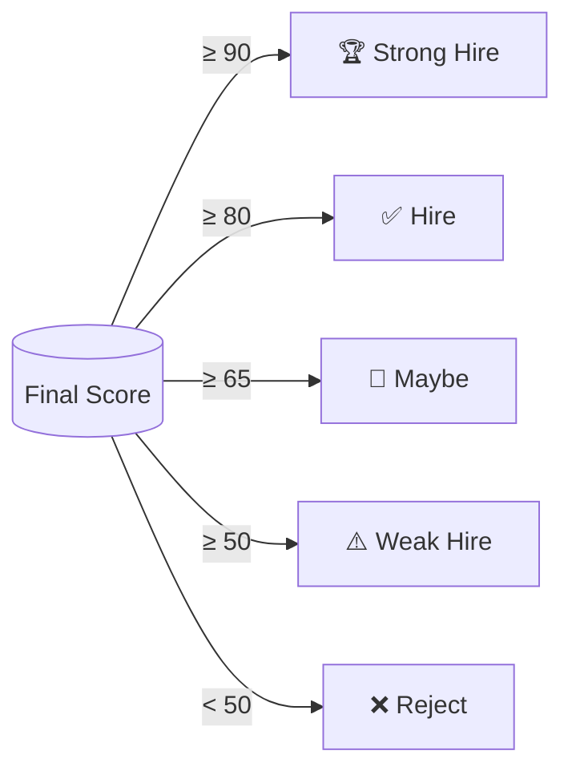
```mermaid
flowchart LR
    SCORE[("Final Score")] --> |"≥ 90"| SH["🏆 Strong Hire"]
    SCORE --> |"≥ 80"| H["✅ Hire"]
    SCORE --> |"≥ 65"| M["🤔 Maybe"]
    SCORE --> |"≥ 50"| WH["⚠️ Weak Hire"]
    SCORE --> |"< 50"| R["❌ Reject"]
```

---

## 7. نظام ATS — Applicant Tracking System

```mermaid
flowchart TD
    UPLOAD[("📄 CV Upload PDF/DOCX")] --> TEXT[("1. Text Extraction<br/>pdfminer.six → PyPDF2")]
    TEXT --> CHUNK[("2. Chunking<br/>size=1000, overlap=200")]
    CHUNK --> EMBED[("3. Embedding<br/>Ollama nomic-embed-text (768d)<br/>أو SentenceTransformer")]
    EMBED --> INDEX[("4. FAISS Index<br/>IndexFlatL2")]
    
    INDEX --> SEARCH[("5. Hybrid Search<br/>0.7*best_chunk + 0.3*avg")]
    
    JD[("📋 Job Description")] --> SEARCH
    
    SEARCH --> SCORE[("6. Smart Scoring")]
    
    subgraph SCORING["🧮 Scoring Algorithm"]
        SK[("Required Skills<br/>50%")]
        SK --> SK_DETAIL["C#, ASP.NET Core, SQL Server<br/>EF Core, REST APIs, Git/GitHub"]
        
        EX[("Experience<br/>20%")]
        EX --> EX_DETAIL["Regex patterns<br/>Date range parsing"]
        
        ED[("Education<br/>10%")]
        ED --> ED_DETAIL["CS/Engineering keywords"]
        
        SEM[("Semantic<br/>20%")]
        SEM --> SEM_DETAIL["FAISS similarity<br/>Log scaling 0-100%"]
    end
    
    SCORE --> PENALTY{("7. Penalties")}
    PENALTY --> P1["Missing C# AND ASP.NET: -50"]
    PENALTY --> P2["Non-.NET skills + no .NET: -60 ❌ REJECT"]
    PENALTY --> P3["Keyword stuffing: -10 skill, -15 exp"]
    
    PENALTY --> DECISION{("8. Decision")}
    DECISION --> |"≥ 80"| ACCEPT["✅ ACCEPT"]
    DECISION --> |"≥ 50"| REVIEW["🔍 REVIEW"]
    DECISION --> |"< 50"| REJECT["❌ REJECT"]
    
    ACCEPT --> LLM[("9. LLM Re-ranking<br/>Qwen3<br/>Top-10 → Top 3-5")]
    REVIEW --> LLM
    LLM --> FINAL[("🏁 Final Ranking<br/>+ Arabic Feedback")]
```

### أوزان ATS

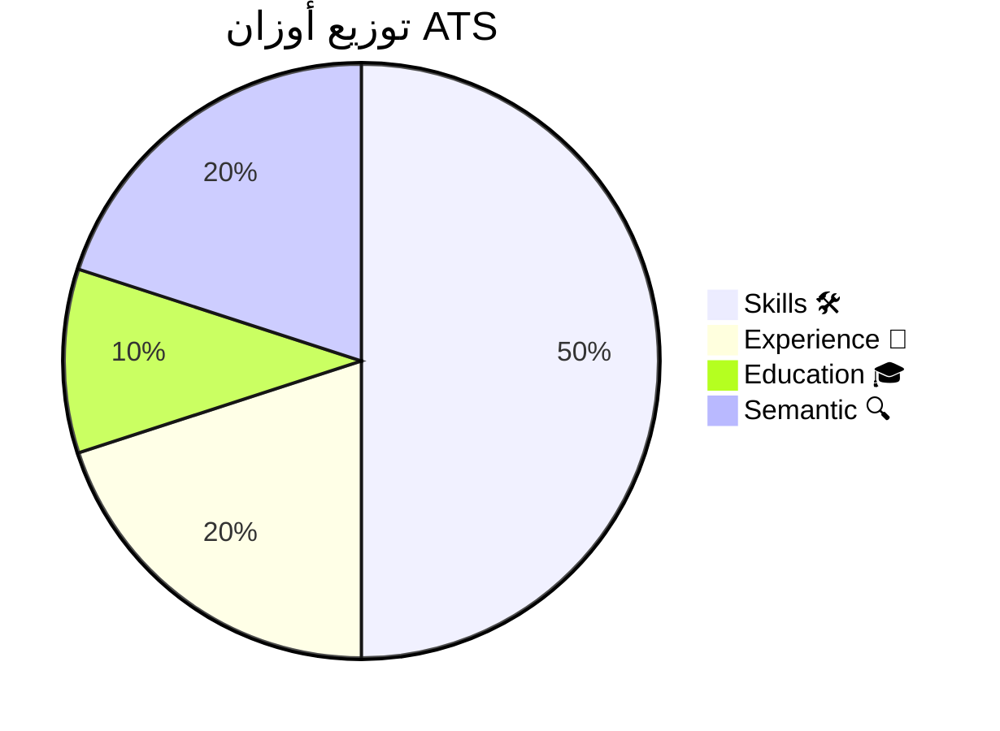
```mermaid
pie title توزيع أوزان ATS
    "Skills 🛠️" : 50
    "Experience 📅" : 20
    "Education 🎓" : 10
    "Semantic 🔍" : 20
```

### المهارات المطلوبة

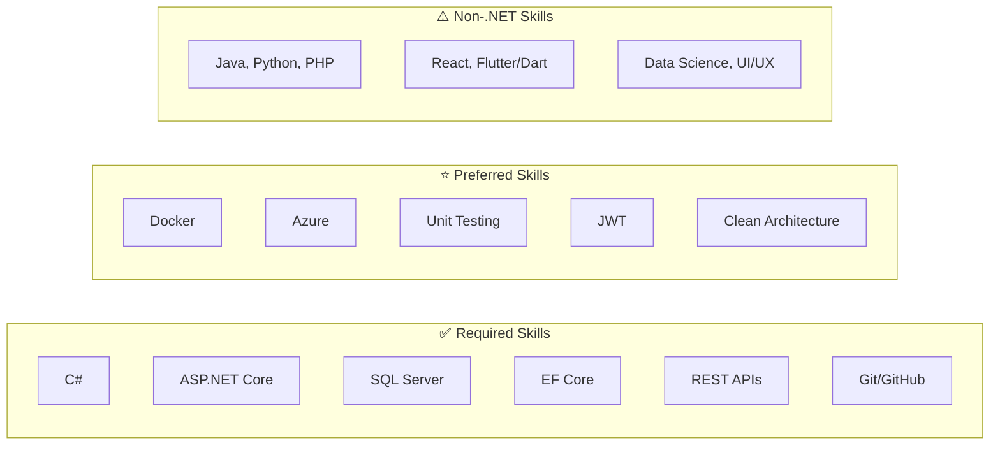
```mermaid
flowchart LR
    subgraph REQUIRED["✅ Required Skills"]
        R1["C#"]
        R2["ASP.NET Core"]
        R3["SQL Server"]
        R4["EF Core"]
        R5["REST APIs"]
        R6["Git/GitHub"]
    end
    
    subgraph PREFERRED["⭐ Preferred Skills"]
        P1["Docker"]
        P2["Azure"]
        P3["Unit Testing"]
        P4["JWT"]
        P5["Clean Architecture"]
    end
    
    subgraph PENALTY_SKILLS["⚠️ Non-.NET Skills"]
        N1["Java, Python, PHP"]
        N2["React, Flutter/Dart"]
        N3["Data Science, UI/UX"]
    end
```

---

## 8. نظام Quiz — 5 مراحل أكاديمية

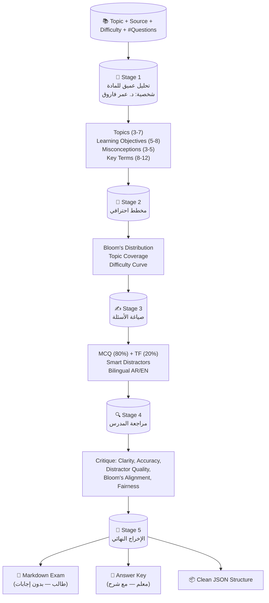
```mermaid
flowchart TD
    INPUT[("📚 Topic + Source + Difficulty + #Questions")] --> S1[("📖 Stage 1<br/>تحليل عميق للمادة<br/>شخصية: د. عمر فاروق")]
    
    S1 --> S1_OUT["Topics (3-7)<br/>Learning Objectives (5-8)<br/>Misconceptions (3-5)<br/>Key Terms (8-12)"]
    S1_OUT --> S2[("📐 Stage 2<br/>مخطط احترافي")]
    
    S2 --> S2_OUT["Bloom's Distribution<br/>Topic Coverage<br/>Difficulty Curve"]
    S2_OUT --> S3[("✍️ Stage 3<br/>صياغة الأسئلة")]
    
    S3 --> S3_OUT["MCQ (80%) + TF (20%)<br/>Smart Distractors<br/>Bilingual AR/EN"]
    S3_OUT --> S4[("🔍 Stage 4<br/>مراجعة المدرس")]
    
    S4 --> S4_OUT["Critique: Clarity, Accuracy,<br/>Distractor Quality,<br/>Bloom's Alignment, Fairness"]
    S4_OUT --> S5[("🎯 Stage 5<br/>الإخراج النهائي")]
    
    S5 --> MD["📝 Markdown Exam<br/>(طالب — بدون إجابات)"]
    S5 --> AK["🔑 Answer Key<br/>(معلم — مع شرح)"]
    S5 --> JSON["📦 Clean JSON Structure"]
```

### توزيع Bloom's Taxonomy حسب الصعوبة

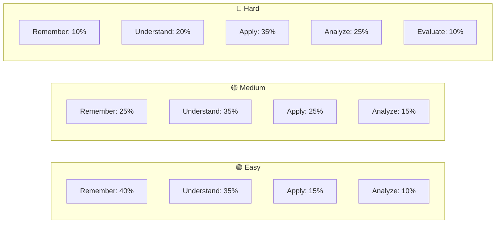
```mermaid
flowchart LR
    subgraph EASY["🟢 Easy"]
        E1["Remember: 40%"]
        E2["Understand: 35%"]
        E3["Apply: 15%"]
        E4["Analyze: 10%"]
    end
    
    subgraph MEDIUM["🟡 Medium"]
        M1["Remember: 25%"]
        M2["Understand: 35%"]
        M3["Apply: 25%"]
        M4["Analyze: 15%"]
    end
    
    subgraph HARD["🔴 Hard"]
        H1["Remember: 10%"]
        H2["Understand: 20%"]
        H3["Apply: 35%"]
        H4["Analyze: 25%"]
        H5["Evaluate: 10%"]
    end
```

### جدول Bloom's Distribution

| المستوى | Easy 🟢 | Medium 🟡 | Hard 🔴 |
|---------|:-------:|:---------:|:-------:|
| Remember | 40% | 25% | 10% |
| Understand | 35% | 35% | 20% |
| Apply | 15% | 25% | 35% |
| Analyze | 10% | 15% | 25% |
| Evaluate | — | — | 10% |

---

## 9. Dual-LLM Orchestrator — Draft & Verify

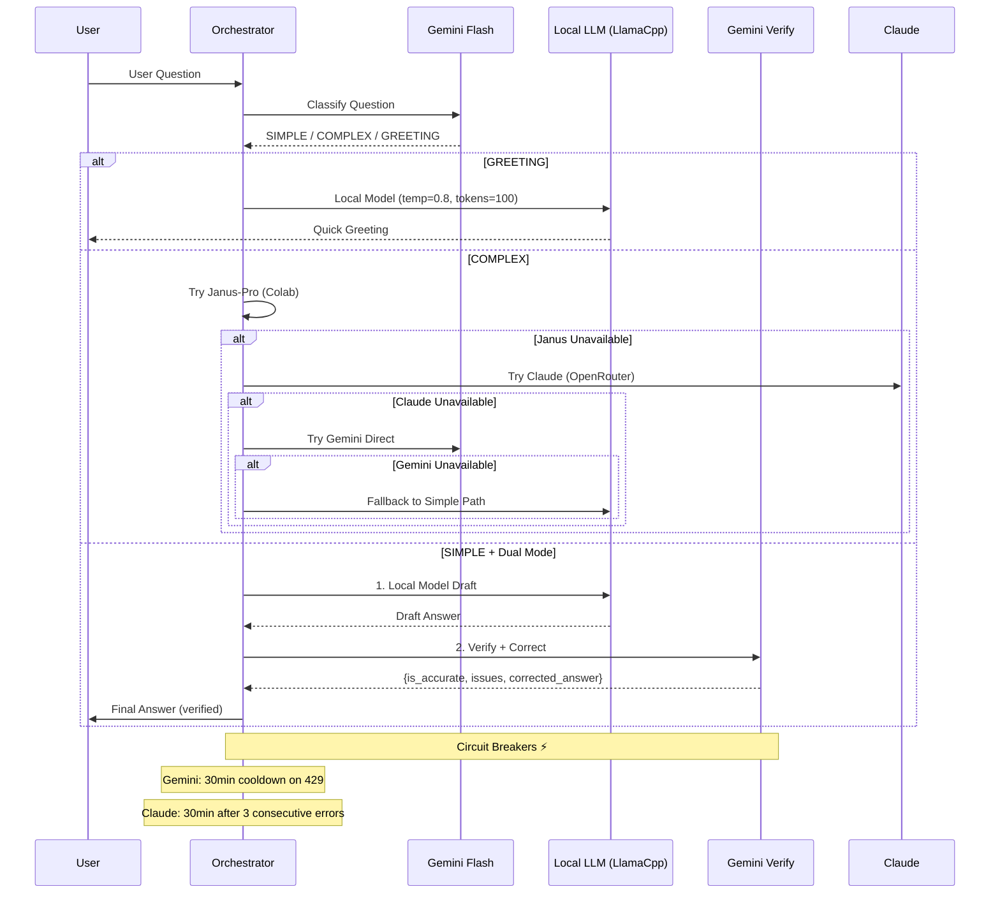
```mermaid
sequenceDiagram
    participant U as User
    participant O as Orchestrator
    participant G as Gemini Flash
    participant L as Local LLM (LlamaCpp)
    participant GV as Gemini Verify
    participant C as Claude
    
    U->>O: User Question
    O->>G: Classify Question
    G-->>O: SIMPLE / COMPLEX / GREETING
    
    alt GREETING
        O->>L: Local Model (temp=0.8, tokens=100)
        L-->>U: Quick Greeting
    else COMPLEX
        O->>O: Try Janus-Pro (Colab)
        alt Janus Unavailable
            O->>C: Try Claude (OpenRouter)
            alt Claude Unavailable
                O->>G: Try Gemini Direct
                alt Gemini Unavailable
                    O->>L: Fallback to Simple Path
                end
            end
        end
    else SIMPLE + Dual Mode
        O->>L: 1. Local Model Draft
        L-->>O: Draft Answer
        O->>GV: 2. Verify + Correct
        GV-->>O: {is_accurate, issues, corrected_answer}
        O->>U: Final Answer (verified)
    end
    
    Note over O,GV: Circuit Breakers ⚡
    Note over O: Gemini: 30min cooldown on 429
    Note over O: Claude: 30min after 3 consecutive errors
```

### تدفق Circuit Breaker

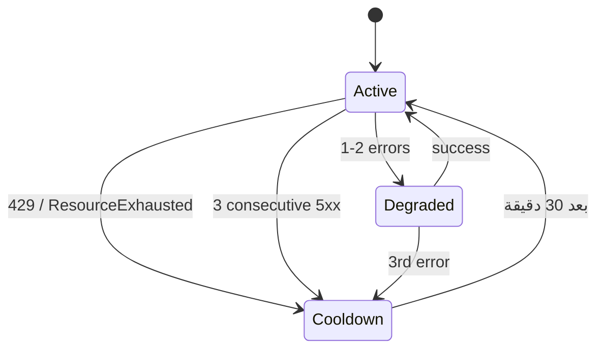
```mermaid
stateDiagram-v2
    [*] --> Active
    Active --> Cooldown: 429 / ResourceExhausted
    Active --> Cooldown: 3 consecutive 5xx
    
    Cooldown --> Active: بعد 30 دقيقة
    
    Active --> Degraded: 1-2 errors
    Degraded --> Active: success
    Degraded --> Cooldown: 3rd error
```

---

## 10. أنظمة الأمان — Anti-Cheat & Consistency

### Anti-Cheat Engine — 4 أنماط كشف

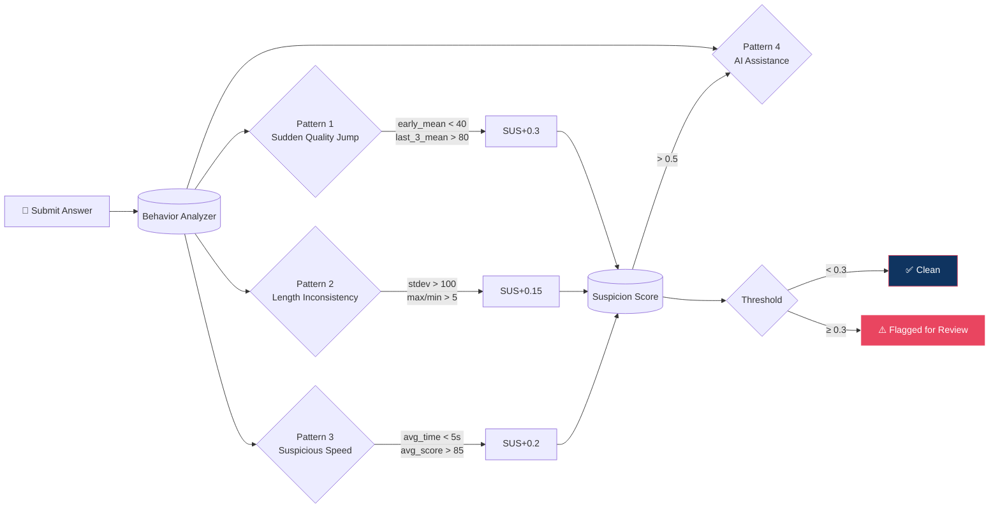
```mermaid
flowchart LR
    SUB["📝 Submit Answer"] --> BA[("Behavior Analyzer")]
    BA --> P1{"Pattern 1<br/>Sudden Quality Jump"}
    BA --> P2{"Pattern 2<br/>Length Inconsistency"}
    BA --> P3{"Pattern 3<br/>Suspicious Speed"}
    BA --> P4{"Pattern 4<br/>AI Assistance"}
    
    P1 --> |"early_mean < 40<br/>last_3_mean > 80"| SUS+0.3
    P2 --> |"stdev > 100<br/>max/min > 5"| SUS+0.15
    P3 --> |"avg_time < 5s<br/>avg_score > 85"| SUS+0.2
    
    SUS+0.3 --> SUS
    SUS+0.15 --> SUS
    SUS+0.2 --> SUS
    
    SUS[("Suspicion Score")] --> |"> 0.5"| P4
    
    SUS --> CHECK{"Threshold"}
    CHECK --> |"< 0.3"| CLEAN["✅ Clean"]
    CHECK --> |"≥ 0.3"| FLAGGED["⚠️ Flagged for Review"]
    
    style FLAGGED fill:#e94560,stroke:#fff,color:#fff
    style CLEAN fill:#0f3460,stroke:#e94560,color:#fff
```

### Consistency Checker — 7 أنواع مخاطر

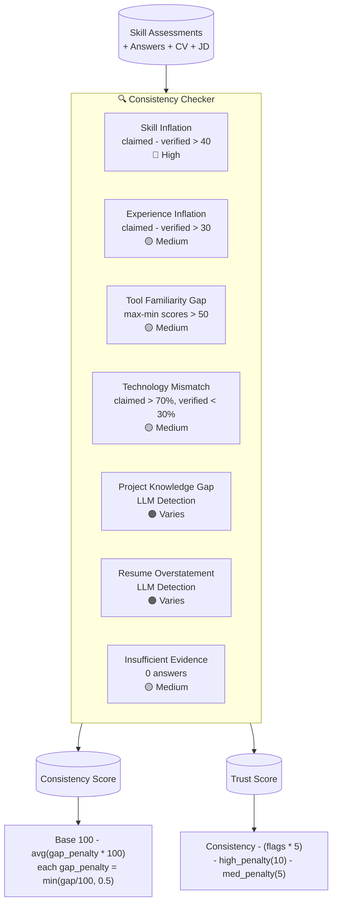
```mermaid
flowchart TD
    ASSESS[("Skill Assessments<br/>+ Answers + CV + JD")] --> CHECK
    
    subgraph CHECK["🔍 Consistency Checker"]
        R1["Skill Inflation<br/>claimed - verified > 40<br/>🔴 High"]
        R2["Experience Inflation<br/>claimed - verified > 30<br/>🟡 Medium"]
        R3["Tool Familiarity Gap<br/>max-min scores > 50<br/>🟡 Medium"]
        R4["Technology Mismatch<br/>claimed > 70%, verified < 30%<br/>🟡 Medium"]
        R5["Project Knowledge Gap<br/>LLM Detection<br/>🟠 Varies"]
        R6["Resume Overstatement<br/>LLM Detection<br/>🟠 Varies"]
        R7["Insufficient Evidence<br/>0 answers<br/>🟡 Medium"]
    end
    
    CHECK --> SCORE_C[("Consistency Score")]
    CHECK --> TRUST_C[("Trust Score")]
    
    SCORE_C --> FORMULA["Base 100 - avg(gap_penalty * 100)<br/>each gap_penalty = min(gap/100, 0.5)"]
    TRUST_C --> FORMULA2["Consistency - (flags * 5)<br/>- high_penalty(10) - med_penalty(5)"]
```

### Interview Memory Engine

```mermaid
flowchart LR
    ANSWER[("💬 Answer")] --> CT[("📌 Claim Tracker")]
    
    CT --> |"Experience Claims"| CD[("🔍 Contradiction Detector")]
    CT --> |"Skill Claims"| CD
    CT --> |"Project Claims"| CD
    
    CD --> |"Experience Contradiction<br/>abs(years_diff) > 2"| TE[("📊 Trust Event")]
    CD --> |"Skill Inflation<br/>avg_score < 40 + 'expert'"| TE
    CD --> |"Project Contradiction<br/>same project, different details"| TE
    
    TE --> |"score < 30 & confidence > 0.7 → -10"| MEMORY[("🧠 Interview Memory")]
    TE --> |"score > 80 & confidence > 0.7 → +5"| MEMORY
    TE --> |"contradictions → -15"| MEMORY
    
    MEMORY --> SUMMARY[("Memory Summary<br/>Claims + Contradictions + Trust Delta")]
```

---

## 11. Action Engine — Phase 7

```mermaid
flowchart TD
    START[("🔹 Execute(approval_id, idempotency_key)")]
    
    START --> S1[("1. Load Draft<br/>AIApprovalDraftRepository")]
    S1 --> S2[("2. Validate Payload<br/>validators.py")]
    S2 --> S3[("3. Check Idempotency<br/>idempotency.py")]
    
    S3 --> |"🔁 Duplicate Key"| CACHED[("✅ Return Cached Result")]
    S3 --> |"🆕 New Request"| S4
    
    S4[("4. Security Check<br/>Tenant/Site Isolation + RBAC")]
    S4 --> |"❌ viewer/candidate"| DENY[("⛔ Access Denied")]
    S4 --> |"✅ Passed"| S5
    
    S5[("5. Status Check<br/>Only 'approved' or 'failed'")]
    S5 --> S6[("6. Load Connector Config<br/>AIConnectorConfigRepository")]
    S6 --> S7[("7. Get Connector<br/>Connector Registry")]
    
    S7 --> GATE{"🔒 Security Gate"}
    GATE --> |"Real Connector<br/>REQUIRES ENABLE_REAL_CONNECTORS"| GATE2
    GATE --> |"Mock Connector"| S8
    
    GATE2{"Global Flag ON?"}
    GATE2 --> |"YES"| S8[("8. Create Delivery Log<br/>AIDeliveryLogRepository")]
    GATE2 --> |"NO"| DENY2[("⛔ Blocked")]
    
    S8 --> S9[("9. Execute Connector")]
    S9 --> |"✅ Success"| SUCCESS[("✅ Approval: executed<br/>Delivery: sent")]
    S9 --> |"❌ Failure"| RETRY{"Retry ≤ max_retries?"}
    RETRY --> |"YES"| S8
    RETRY --> |"NO"| FAIL[("❌ Approval: failed<br/>Delivery: failed")]
```

### Connector Onboarding Stages

```mermaid
flowchart LR
    DRAFT[("📝 Draft")] --> VALIDATED[("✅ Validated")]
    VALIDATED --> SANDBOX[("🧪 Sandbox Test Passed")]
    SANDBOX --> STAGING[("🔬 Enabled Staging")]
    STAGING --> DISABLED[("⏸️ Disabled")]
    STAGING --> FAILED[("❌ Failed")]
    VALIDATED --> FAILED
```

---

## 12. قاعدة البيانات — Database Schema

### Core Tables — chatbot.db

```mermaid
classDiagram
    class User {
        +String id
        +String username
        +String password_hash
        +Boolean is_admin
        +DateTime created_at
    }
    
    class APIKey {
        +String id
        +String key_hash
        +String key_prefix
        +String name
        +Boolean is_active
        +Integer usage_count
        +Integer rate_limit
        +String company_id
        +DateTime last_used_at
    }
    
    class Document {
        +String id
        +String filename
        +String file_type
        +Integer file_size
        +Integer chunk_count
        +Boolean is_indexed
        +String graph_json
        +String full_text
        +String company_id
    }
    
    class DocumentChunk {
        +String id
        +String document_id
        +Integer chunk_index
        +String content
        +String metadata
        +String company_id
    }
    
    class ChatHistory {
        +String id
        +String session_id
        +String question
        +String answer
        +String source_type
        +String source_documents
        +String company_id
    }
    
    class Company {
        +String id
        +String name
        +String slug
        +String business_type
        +String tone
        +String language
        +Boolean is_active
    }
    
    class WebSource {
        +String id
        +String base_url
        +Integer pages_crawled
        +Integer chunk_count
        +String status
        +Integer crawl_depth
    }
    
    Document "1" --> "*" DocumentChunk : has
    Company "1" --> "*" Document : owns
    Company "1" --> "*" APIKey : owns
    Company "1" --> "*" WebSource : owns
```

### Interview Tables — chatbot.db

```mermaid
classDiagram
    class InterviewSession {
        +String id
        +String candidate_id
        +String job_id
        +String status
        +String current_skill
        +Integer technical_score
        +Integer practical_score
        +Integer experience_score
        +Integer communication_score
        +Integer consistency_score
        +Integer trust_score
        +Integer final_score
        +String recommendation
        +String report_json
    }
    
    class InterviewQuestion {
        +String id
        +String session_id
        +String skill
        +String question
        +String question_type
        +Integer difficulty_level
        +Boolean is_followup
        +Integer followup_count
    }
    
    class InterviewAnswer {
        +String id
        +String question_id
        +String session_id
        +String candidate_answer
        +Integer score
        +String strengths
        +String weaknesses
        +Float confidence
    }
    
    class SkillAssessment {
        +String id
        +String session_id
        +String skill
        +Integer claimed_level
        +Integer verified_level
        +Float confidence
        +Integer questions_asked
        +Float average_score
    }
    
    class InterviewChallenge {
        +String id
        +String session_id
        +String skill
        +String challenge_type
        +String title
        +String difficulty
        +String evaluation
    }
    
    class InterviewReport {
        +String id
        +String session_id
        +Integer final_score
        +String recommendation
        +String strengths
        +String weaknesses
        +String skill_breakdown
        +String trust_analysis
    }
    
    InterviewSession "1" --> "*" InterviewQuestion
    InterviewSession "1" --> "*" InterviewAnswer
    InterviewSession "1" --> "*" SkillAssessment
    InterviewSession "1" --> "*" InterviewChallenge
    InterviewSession "1" --> "1" InterviewReport
    InterviewQuestion "1" --> "1" InterviewAnswer
```

### ATS Tables — chatbot.db

```mermaid
classDiagram
    class ATSJobDescription {
        +String id
        +String title
        +String description
        +Integer top_n
        +String status
        +String results_json
        +Integer cv_count
    }
    
    class ATSCV {
        +String id
        +String filename
        +String full_text
        +String candidate_name
        +String skills_json
        +String llm_feedback
        +String llm_model
        +Integer chunk_count
    }
    
    class ATSChunk {
        +String id
        +String cv_id
        +Integer chunk_index
        +String content
    }
    
    ATSJobDescription --> ATSCV : ranks
    ATSCV "1" --> "*" ATSChunk : has
```

---

## 13. Redis Cache Layer

```mermaid
flowchart LR
    subgraph APP["Application"]
        AE[("Answer Evaluator")]
        CG[("Challenge Generator")]
        BM[("Benchmark Engine")]
    end
    
    subgraph CACHE["RedisCache Layer"]
        direction TB
        REDIS[("🔄 Redis<br/>localhost:6379")]
        MEM[("💾 In-Memory Dict<br/>(Fallback)")]
    end
    
    AE --> |"eval:{skill}:{hash}:{diff}"| CACHE
    CG --> |"challenge:{skill}:{type}:{level}"| CACHE
    BM --> |"historical_scores:{company}"| CACHE
    
    REDIS --> |"❌ Unavailable"| MEM
    
    subgraph TTL["⏱️ TTL Settings"]
        T1["eval_cache: 600s<br/>(10 minutes)"]
        T2["challenge_cache: 1800s<br/>(30 minutes)"]
        T3["benchmark_cache: 300s<br/>(5 minutes)"]
    end
```

---

## 14. خريطة التكامل بين المكونات

```mermaid
flowchart TD
    FLASK[("🌐 Flask App<br/>main.py")] --> CR[("ChatRouter<br/>Pipeline")]
    CR --> SUP[("Supervisor Graph<br/>LangGraph")]
    
    SUP --> RAG[("RAG Graph<br/>6 Nodes")]
    SUP --> CHAT[("Chat Agent<br/>ReAct + Tools")]
    
    RAG --> KB[("Knowledge Base<br/>FAISS + BM25 Hybrid")]
    RAG --> DP[("Document Processor<br/>PDF/DOCX Parser")]
    
    CHAT --> DLLM[("Dual-LLM<br/>Orchestrator")]
    
    DLLM --> LOCAL[("LlamaCpp/Ollama<br/>Local Model")]
    DLLM --> CLOUD[("Gemini / Claude<br/>Cloud Model")]
    
    KB --> VB[("Vector Backend<br/>FAISS / pgvector")]
    KB --> DB[("Database<br/>SQLite")]
    
    FLASK --> IS[("Interview Service")]
    IS --> IG[("Interview Graph<br/>17 Nodes")]
    
    IG --> AE2[("Answer Evaluator<br/>Hybrid Scoring")]
    IG --> CC[("Consistency Checker<br/>7 Risk Types")]
    IG --> ACE[("Anti-Cheat Engine<br/>4 Patterns")]
    IG --> CG2[("Challenge Generator<br/>+ Evaluator")]
    IG --> BE[("Benchmark Engine<br/>Percentile")]
    IG --> IM[("Interview Memory<br/>Claims + Trust")]
    IG --> FR[("Final Report<br/>Recruiter Copilot")]
    
    FLASK --> QUIZ[("Quiz Pipeline<br/>5 Stages")]
    FLASK --> ATS[("ATS Pipeline<br/>FAISS + Scoring")]
    
    AE2 --> REDIS[("Redis Cache")]
    CG2 --> REDIS
    BE --> REDIS
    
    DB --> FILES[("📁 FAISS Index Files")]
    
    style FLASK fill:#1a1a2e,stroke:#e94560,stroke-width:3px,color:#fff
    style SUP fill:#e94560,stroke:#fff,stroke-width:2px,color:#fff
    style IG fill:#e94560,stroke:#fff,stroke-width:2px,color:#fff
    style DLLM fill:#533483,stroke:#e94560,stroke-width:2px,color:#fff
    style KB fill:#16213e,stroke:#0f3460,stroke-width:2px,color:#fff
    style DB fill:#0f3460,stroke:#e94560,stroke-width:2px,color:#fff
```

---

## 15. جميع الأوزان والقيم الثابتة

### جدول مركزي لكل القيم

```mermaid
flowchart LR
    subgraph EVAL["📝 Answer Evaluation Weights"]
        EV1["Concept Match: 25%"]
        EV2["LLM Accuracy: 20%"]
        EV3["Keyword: 15%"]
        EV4["LLM Coverage: 15%"]
        EV5["Knowledge: 10%"]
        EV6["Structure: 10%"]
        EV7["Completeness: 5%"]
    end
    
    subgraph INT["🎯 Interview Weights"]
        I1["Technical: 35%"]
        I2["Practical: 20%"]
        I3["Experience: 15%"]
        I4["Consistency: 15%"]
        I5["Communication: 10%"]
        I6["Trust: 5%"]
    end
    
    subgraph ATS_W["📊 ATS Weights"]
        A1["Skills: 50%"]
        A2["Experience: 20%"]
        A3["Education: 10%"]
        A4["Semantic: 20%"]
    end
    
    subgraph SKILL_P["⚙️ Skill Priority"]
        S1["JD Score: 50%"]
        S2["CV Score: 30%"]
        S3["ATS Similarity: 20%"]
    end
    
    subgraph CHALLENGE["💻 Challenge Evaluation"]
        C1["Correctness: 40%"]
        C2["Code Quality: 30%"]
        C3["Efficiency: 30%"]
    end

    subgraph THRESHOLDS["📏 Thresholds"]
        T1["Interview Rec: ≥90 Strong, ≥80 Hire, ≥65 Maybe, ≥50 Weak"]
        T2["ATS: ≥80 ACCEPT, ≥50 REVIEW, <50 REJECT"]
        T3["Trust Gap: >20, High Flag: >40, Medium: >30"]
        T4["Anti-Cheat: <0.3 Clean, ≥0.3 Flagged"]
        T5["Challenge Difficulty: max(1, verified/25)"]
    end

    subgraph CONFIG["⚙️ Config"]
        CF1["LLM Timeout: 400s"]
        CF2["Agent Timeout: 400s"]
        CF3["Max Iterations: 5"]
        CF4["Chunk Size: 800"]
        CF5["Chunk Overlap: 100"]
        CF6["Embedding Dim: 768"]
        CF7["Temperature: 0.5"]
        CF8["Context Length: 8192"]
        CF9["Graph Recursion: 150"]
        CF10["Max Follow-ups: 3"]
    end
```

---

## 16. AI Storage — ai_storage.db

```mermaid
classDiagram
    class AIDocument {
        +String id
        +String tenant_id
        +String site_id
        +String bot_id
        +String source_type
        +String source_id
        +String source_name
        +String visibility
        +String text
        +Dict metadata
    }
    
    class AIChunk {
        +String id
        +String document_id
        +String tenant_id
        +String chunk_text
        +String embedding_id
        +String visibility
    }
    
    class AIMemory {
        +String id
        +String tenant_id
        +String session_id
        +String user_id
        +String memory_type
        +String content
        +String visibility
        +Integer ttl_seconds
        +DateTime expires_at
    }
    
    class AICandidateProfile {
        +String id
        +String candidate_id
        +String profile
        +String source
    }
    
    class AIJobDraft {
        +String id
        +String job_id
        +String title
        +String job_post
        +String status
    }
    
    class AIApplicationDraft {
        +String id
        +String candidate_id
        +List~String~ job_ids
        +String cover_letter_draft
        +String status
        +Boolean requires_approval
    }
    
    class AIRankingRun {
        +String id
        +String job_id
        +List~Dict~ ranked_candidates
        +Integer limit
        +Boolean requires_human_review
    }
    
    class AIAuditEvent {
        +String id
        +String event_type
        +String actor_type
        +String action
        +Dict model_trace
        +Boolean approval_required
    }
    
    class AIApprovalDraft {
        +String id
        +String action_type
        +Dict draft_payload
        +String risk_level
        +String status
        +String idempotency_key
        +Integer retry_count
    }
    
    class AIConnectorConfig {
        +String id
        +String connector_type
        +String auth_type
        +String endpoint
        +Boolean dry_run
        +String onboarding_status
    }
    
    class AIDeliveryLog {
        +String id
        +String approval_id
        +String connector_type
        +String status
        +Integer attempt_count
        +String external_reference
    }
    
    class AIInterviewSession {
        +String id
        +String job_id
        +String candidate_id
        +String status
        +String consent_status
    }
    
    class AIInterviewMessage {
        +String id
        +String interview_id
        +String sender
        +String message
        +String message_type
    }
    
    class AIInterviewReport {
        +String id
        +String interview_id
        +Integer technical_score
        +Integer communication_score
        +Integer job_fit_score
        +String recommendation
        +String strengths
        +String concerns
    }
    
    AIDocument "1" --> "*" AIChunk : has
    AIApprovalDraft "1" --> "*" AIDeliveryLog : triggers
    AIInterviewSession "1" --> "*" AIInterviewMessage : contains
    AIInterviewSession "1" --> "1" AIInterviewReport : produces
```

### Approval Workflow States

```mermaid
stateDiagram-v2
    [*] --> Draft
    
    Draft --> PendingBackendApproval: رفع للموافقة
    
    PendingBackendApproval --> Approved: موافقة
    PendingBackendApproval --> Rejected: رفض
    
    Approved --> Executing: تنفيذ
    Executing --> Executed: ✅ نجاح
    Executing --> Failed: ❌ فشل
    
    Failed --> Executing: إعادة محاولة
    
    state Rejected {
        [*] --> Rejected
        Rejected --> [*]
    }
```

---

## 17. خريطة المسارات — All Flask Routes

```mermaid
flowchart TD
    subgraph AUTH["🔐 Auth"]
        A1["POST /auth/login"]
        A2["GET /auth/logout"]
    end
    
    subgraph ADMIN["⚙️ Admin"]
        AD1["GET /admin/dashboard"]
        AD2["GET /admin/documents"]
        AD3["POST /admin/upload"]
        AD4["GET /admin/document_graph/{id}"]
        AD5["POST /admin/delete_document"]
        AD6["GET /admin/websites"]
        AD7["POST /admin/crawl_website"]
        AD8["GET /admin/models"]
        AD9["POST /admin/models"]
        AD10["GET /admin/api_keys"]
        AD11["POST /admin/create_api_key"]
        AD12["POST /admin/toggle_api_key"]
        AD13["GET /admin/chat"]
        AD14["POST /admin/send_chat"]
        AD15["GET /admin/debug_search"]
        AD16["GET /admin/extract_tables"]
        AD17["GET /admin/companies"]
        AD18["GET /admin/company/{id}"]
        AD19["POST /admin/company/save"]
        AD20["POST /admin/company/delete"]
        AD21["GET /admin/companies/source_chunks/{id}"]
        AD22["GET /admin/ats_dashboard"]
        AD23["POST /admin/ats_upload"]
        AD24["POST /admin/ats_analyze"]
        AD25["GET /admin/ats_results/{job_id}"]
        AD26["POST /admin/ats_reset"]
        AD27["GET /admin/quizzes"]
        AD28["GET /admin/quiz/create"]
        AD29["POST /admin/quiz/generate"]
        AD30["GET /admin/quiz/{id}"]
    end
    
    subgraph API["🌐 Public API"]
        API1["POST /api/v1/chat"]
        API2["POST /api/v1/generate_quiz"]
    end
    
    subgraph AI_ADMIN["🤖 AI Admin (Phase 7)"]
        AI1["GET /admin/ai/"]
        AI2["GET /admin/ai/candidates"]
        AI3["GET /admin/ai/candidates/{id}"]
        AI4["GET /admin/ai/jobs"]
        AI5["GET /admin/ai/jobs/{id}"]
        AI6["GET /admin/ai/applications"]
        AI7["GET /admin/ai/applications/{id}"]
        AI8["GET /admin/ai/rankings"]
        AI9["GET /admin/ai/rankings/{id}"]
        AI10["GET /admin/ai/audit"]
        AI11["GET /admin/ai/approvals"]
        AI12["POST /admin/ai/approvals/{id}/approve"]
        AI13["POST /admin/ai/approvals/{id}/reject"]
        AI14["GET /admin/ai/approvals/{id}"]
        AI15["GET /admin/ai/interviews"]
        AI16["GET /admin/ai/interviews/{id}"]
        AI17["GET /admin/ai/interviews/{id}/report"]
        AI18["POST /admin/ai/interviews/{id}/cancel"]
        AI19["GET /admin/ai/connectors"]
        AI20["POST /admin/ai/connectors/save"]
        AI21["GET /admin/ai/connectors/{id}"]
    end
    
    subgraph INTERVIEW["🎤 Interview"]
        IV1["GET /interview/{session_id}"]
        IV2["POST /interview/{session_id}/start"]
        IV3["POST /interview/{session_id}/answer"]
        IV4["GET /interview/{session_id}/next"]
        IV5["GET /interview/{session_id}/status"]
        IV6["POST /interview/{session_id}/skip"]
        IV7["GET /interview/{session_id}/time"]
        IV8["GET /interview/{session_id}/report"]
        IV9["GET /interview/analytics"]
        IV10["POST /interview/challenge/generate"]
        IV11["POST /interview/challenge/evaluate"]
    end
```

---

## 18. Admin UI — جميع القوالب

```mermaid
flowchart LR
    BASE[("base.html<br/>Master Layout<br/>Sidebar عربي + RTL")] --> CSS[("style.css<br/>1041 lines<br/>Dark Theme")]
    BASE --> JS[("app.js<br/>Utilities")]
    
    BASE --> AUTH["login.html"]
    BASE --> DASH["dashboard.html"]
    BASE --> CHAT["chat.html"]
    BASE --> MODELS["models.html"]
    
    BASE --> DOCS["documents.html<br/>document_graph.html<br/>source_chunks.html"]
    BASE --> WEB["websites.html<br/>extract_tables.html"]
    BASE --> API_KEYS["api_keys.html"]
    BASE --> COMP["companies.html<br/>company_form.html"]
    
    BASE --> ATS["ats_main.html<br/>ats_results.html"]
    BASE --> QUIZ["quizzes_list.html<br/>quiz_create.html<br/>quiz_view.html"]
    BASE --> DEBUG["debug_search.html"]
    
    BASE --> INT_DASH["interview_dashboard.html"]
    BASE --> INT_SESS["interview_session.html"]
    BASE --> INT_ANAL["interview_analytics.html"]
    BASE --> INT_CHAL["interview_challenge_test.html"]
    
    CAND["candidate/interview.html<br/>(واجهة المرشح)<br/>لا extend base.html"] --- INT
    
    BASE --> AI_ADMIN_OVER["ai/overview.html"]
    BASE --> AI_CAND["ai/candidate_profiles.html<br/>ai/candidate_profile_detail.html"]
    BASE --> AI_JOBS["ai/job_drafts.html<br/>ai/job_draft_detail.html"]
    BASE --> AI_APPS["ai/application_drafts.html<br/>ai/application_draft_detail.html"]
    BASE --> AI_RANK["ai/ranking_runs.html<br/>ai/ranking_run_detail.html"]
    BASE --> AI_APPROV["ai/approval_console.html<br/>ai/approval_detail.html"]
    BASE --> AI_AUDIT["ai/audit_logs.html"]
    BASE --> AI_INT["ai/interviews_list.html<br/>ai/interview_detail.html<br/>ai/interview_report.html"]
    BASE --> AI_CONN["ai/connectors_list.html<br/>ai/connector_detail_onboarding.html"]
```

### إحصائيات القوالب

| المجموعة | العدد | الملفات |
|----------|:-----:|---------|
| Templates | 39 | HTML |
| CSS | 1 | style.css (1041 lines) |
| JS | 1 | app.js |
| Images | 1 | rag_graph.png |
| **الإجمالي** | **42** | **ملف** |

---

## 🏁 خاتمة

هذا المشروع هو **منصة توظيف ذكية متكاملة** مبنية على:

| النظام | التقنية الأساسية | الحالة |
|--------|-----------------|:------:|
| **التوجيه الذكي** | LangGraph Supervisor + Gemini | ✅ |
| **المحادثة الذكية** | RAG (FAISS + BM25) + Dual-LLM | ✅ |
| **المقابلات الذكية** | LangGraph (17 Node) + 10 Upgrades | ✅ |
| **تحليل السير الذاتية** | ATS (.NET Focus) + FAISS | ✅ |
| **توليد الاختبارات** | 5-Stage Academic Methodology | ✅ |
| **الإجراءات الذكية** | Action Engine + Approval Workflow | ✅ |
| **التخزين** | SQLite WAL + Multi-tenant | ✅ |
| **الذاكرة المؤقتة** | Redis + In-Memory Fallback | ✅ |
| **الواجهات** | 42 HTML Templates (Dark Theme) | ✅ |

---

*تم إنشاء هذا التقرير بواسطة AI Agent — 14 يونيو 2026*
