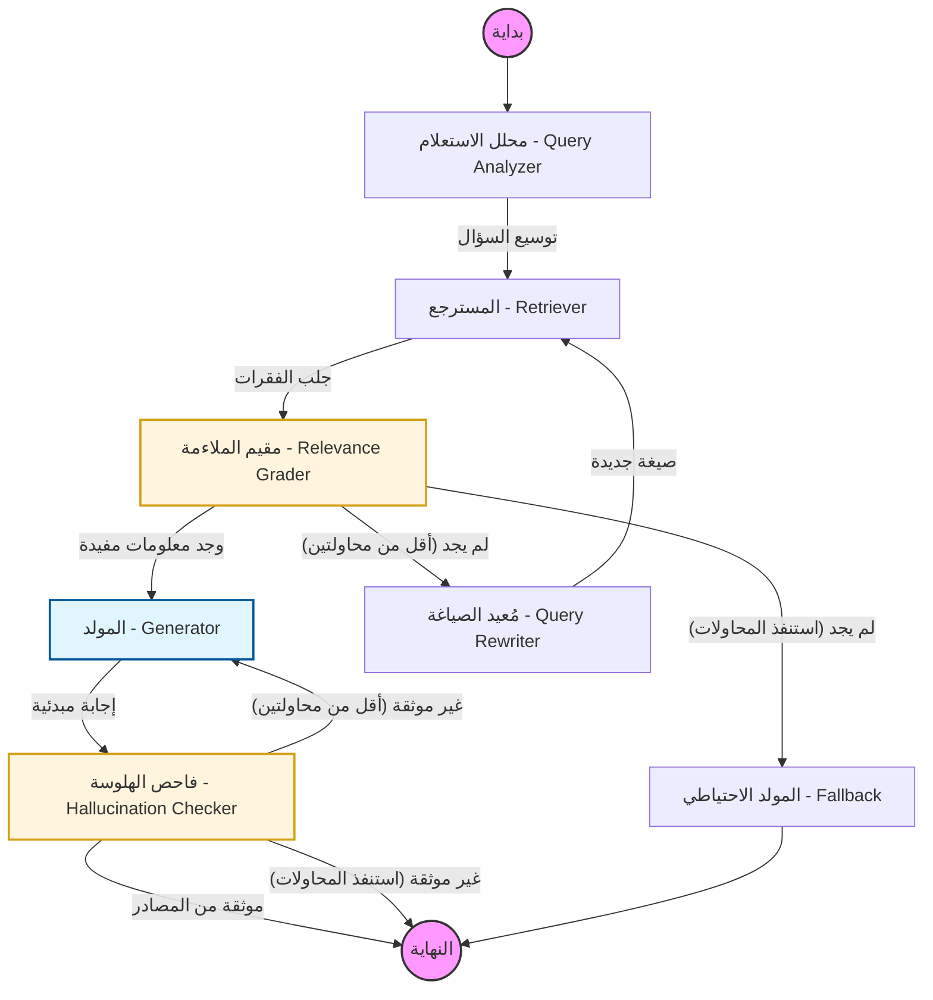

# MAESTA RAG Graph — Visual Documentation

هذا الرسم التوضيحي يشرح بالتفصيل كيف يتم معالجة السؤال داخل نظام الـ **RAG Graph** لضمان أعلى دقة وتجنب الإجابات الخاطئة.

## مخطط سير العمل (Mermaid Diagram)

## شرح المكونات (Nodes Breakdown)

1.  **Query Analyzer**: يقوم بتحليل سؤال المستخدم للكشف عن الـ **Intent**. إذا كان السؤال عن "اسم المشروع" أو "وصف المشروع"، يتم توجيهه مباشرة بكلمات مفتاحية دقيقة. بخلاف ذلك، يتم توسيع السؤال لصيغ مختلفة.
2.  **Retriever**: يقوم بالبحث الدلالي في قاعدة البيانات وجلب أكثر الفقرات صلة بناءً على الاستعلامات المحسنة.
3.  **Relevance Grader**: يعمل بنظام **هجين (Hybrid)**. للأسئلة عن المشروع، يستخدم قواعد برمجية (Rule-based) للتحقق من الكلمات المفتاحية لضمان عدم استبعاد المستندات الصحيحة. للأسئلة العامة، يستخدم الـ LLM للتقييم.
4.  **Query Rewriter**: في حال فشل البحث الأول، يقوم بإعادة كتابة السؤال بكلمات مفتاحية مختلفة تماماً لمحاولة جلب نتائج أفضل.
5.  **Generator**: يقوم بكتابة الإجابة النهائية بناءً على الفقرات "الموثوقة" فقط، مع الالتزام بشخصية MAESTA.
6.  **Hallucination Checker**: يتأكد أن الموديل لم يخترع معلومات من عنده (هلوسة) وأن الإجابة مدعومة بالكامل من المستندات المسترجعة.

---
*تم إنشاء هذا التوثيق لضمان شفافية عمل النظام.*
